# AI助教系统架构设计文档

## 版本信息
- 版本: v1.0
- 日期: 2025-01
- 状态: 设计阶段

---

## 1. 整体架构设计

### 1.1 分层架构概览

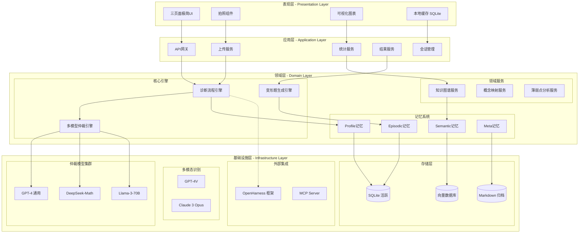

### 1.2 OpenHarness子系统映射关系

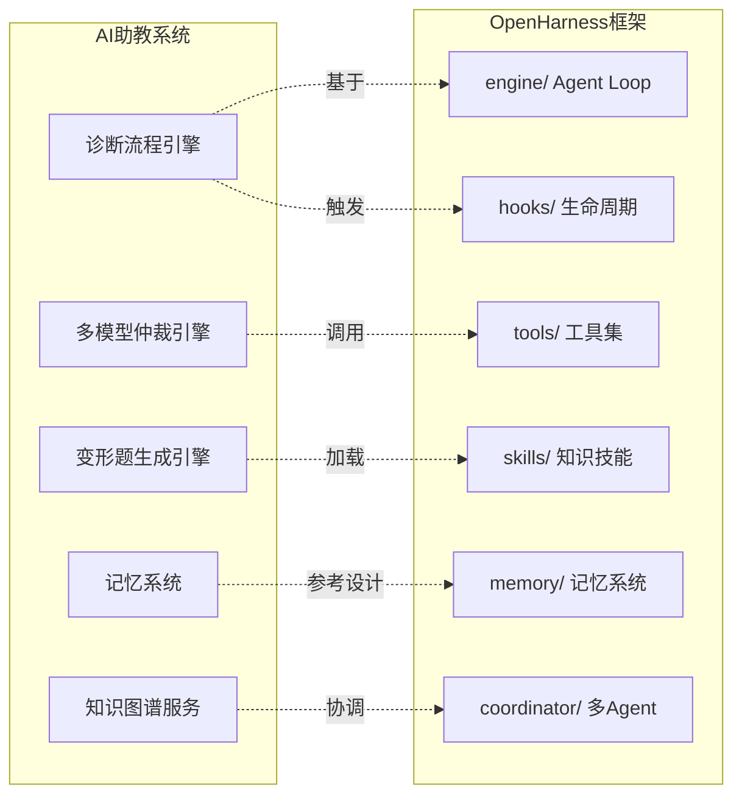

---

## 2. 模块详细设计

### 2.1 模块职责边界

| 模块 | 职责边界 | 输入 | 输出 | 依赖 |
|------|---------|------|------|------|
| **表现层** | 用户交互、本地缓存、UI渲染 | 用户操作、拍照数据 | 页面展示、本地状态 | 应用层API |
| **应用层** | 请求路由、会话管理、服务编排 | HTTP请求、文件流 | JSON响应、会话状态 | 领域层服务 |
| **诊断流程引擎** | 90秒闭环流程 orchestration | 作业图片+描述 | 诊断结果+变形题 | 仲裁引擎、记忆系统 |
| **多模型仲裁引擎** | 3模型推理+加权聚合 | 题目内容 | 仲裁结果+置信度 | 模型集群 |
| **变形题生成引擎** | 基于薄弱点生成变式题 | 原题+错误类型 | 分层变形题 | 知识图谱、记忆系统 |
| **记忆系统** | 学生认知画像持久化 | 学习事件 | 认知状态 | 存储层 |
| **知识图谱服务** | 知识点关系管理 | 题目/错误 | 知识路径 | 向量数据库 |

### 2.2 模块依赖关系图

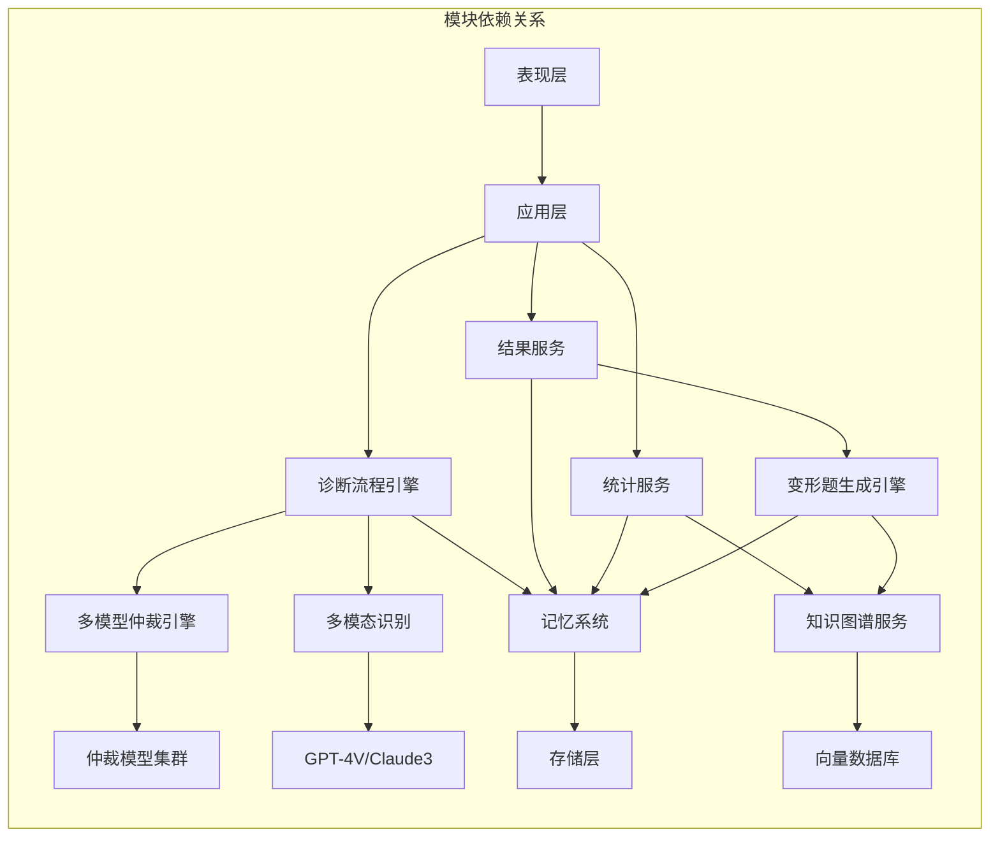

### 2.3 接口契约定义

#### 2.3.1 作业上传接口

```typescript
// 请求
interface UploadHomeworkRequest {
  studentId: string;
  imageBase64: string;           // 作业照片
  parentDescription?: string;    // 家长描述（可选）
  subject: 'math' | 'physics' | 'chemistry';
  timestamp: number;
}

// 响应
interface UploadHomeworkResponse {
  taskId: string;
  status: 'processing' | 'completed' | 'failed';
  estimatedTime: number;         // 预计处理时间（秒）
  progress?: number;             // 处理进度 0-100
}

// 错误码
enum UploadErrorCode {
  INVALID_IMAGE = 'E001',        // 图片格式无效
  IMAGE_TOO_LARGE = 'E002',      // 图片过大
  UNSUPPORTED_SUBJECT = 'E003',  // 不支持的学科
  SERVICE_UNAVAILABLE = 'E500',  // 服务不可用
}
```

#### 2.3.2 诊断结果接口

```typescript
// 请求
interface GetDiagnosisRequest {
  taskId: string;
  studentId: string;
}

// 响应
interface GetDiagnosisResponse {
  taskId: string;
  status: 'processing' | 'completed' | 'failed';
  diagnosis?: DiagnosisResult;
  error?: DiagnosisError;
}

interface DiagnosisResult {
  originalProblems: Problem[];   // 原题解析
  wrongProblems: WrongProblem[]; // 错题诊断
  generatedVariants: VariantProblem[]; // 变形题
  knowledgeUpdate: KnowledgeUpdate; // 知识图谱更新
  processingTime: number;        // 实际处理时间
}

interface WrongProblem {
  problemId: string;
  errorType: ErrorType;
  rootCause: string;             // 根本原因分析
  conceptGap: string[];          // 概念缺口
  confidence: number;            // 诊断置信度 0-1
}

enum ErrorType {
  CONCEPT_MISUNDERSTANDING = 'concept',  // 概念误解
  CALCULATION_ERROR = 'calculation',     // 计算错误
  LOGICAL_FLAW = 'logic',                // 逻辑漏洞
  CARELESS_MISTAKE = 'careless',         // 粗心错误
  KNOWLEDGE_GAP = 'knowledge',           // 知识缺口
}

// 错误处理
interface DiagnosisError {
  code: string;
  message: string;
  retryable: boolean;
}
```

#### 2.3.3 变形题接口

```typescript
// 请求
interface GenerateVariantsRequest {
  studentId: string;
  originalProblemId: string;
  errorType: ErrorType;
  difficulty: 'same' | 'easier' | 'harder';
  count: number;                 // 生成数量 1-3
}

// 响应
interface GenerateVariantsResponse {
  variants: VariantProblem[];
  generationMetadata: {
    modelUsed: string[];
    confidence: number;
    generationTime: number;
  };
}

interface VariantProblem {
  variantId: string;
  content: string;
  difficulty: number;            // 1-10
  targetConcept: string;         // 针对的概念
  hint?: string;                 // 提示
  expectedSteps: number;         // 预期步骤数
}
```

#### 2.3.4 记忆系统接口

```typescript
// 学生认知画像查询
interface GetStudentProfileRequest {
  studentId: string;
}

interface StudentProfile {
  studentId: string;
  cognitiveLevel: CognitiveLevel;
  learningStyle: LearningStyle;
  weakConcepts: ConceptStrength[];
  strongConcepts: ConceptStrength[];
  recentMistakes: MistakePattern[];
  lastUpdated: number;
}

interface ConceptStrength {
  conceptId: string;
  conceptName: string;
  masteryLevel: number;          // 0-1
  attemptCount: number;
  successRate: number;
}

// 学习事件记录
interface RecordLearningEventRequest {
  studentId: string;
  eventType: LearningEventType;
  problemId: string;
  conceptIds: string[];
  result: 'success' | 'failure' | 'hint_used';
  timeSpent: number;
  timestamp: number;
}

enum LearningEventType {
  PROBLEM_ATTEMPT = 'attempt',
  VARIANT_PRACTICE = 'variant',
  HINT_REQUEST = 'hint',
  CONCEPT_REVIEW = 'review',
}
```

---

## 3. 核心子系统设计

### 3.1 多模型仲裁引擎设计

#### 3.1.1 架构图

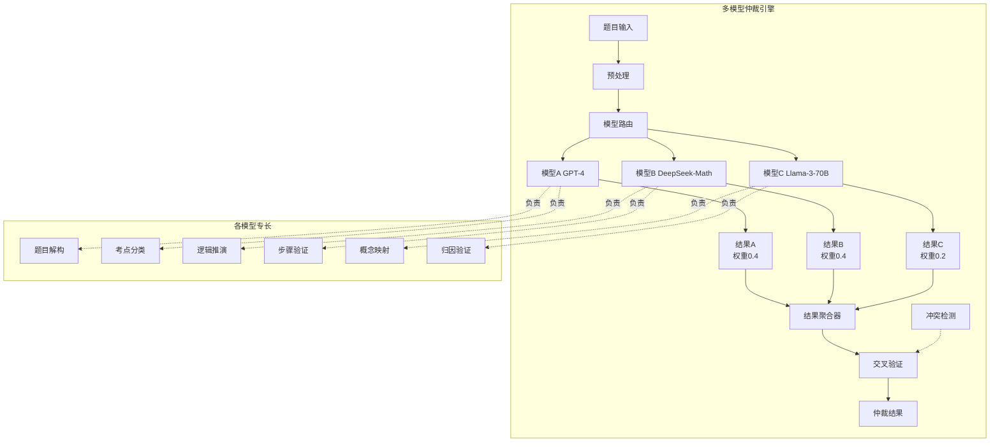

#### 3.1.2 仲裁流程

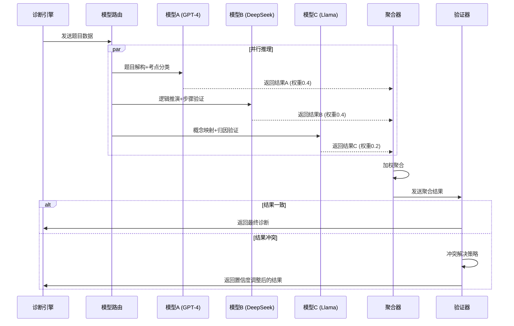

#### 3.1.3 仲裁算法

```python
class ArbitrationEngine:
    """多模型仲裁引擎"""
    
    MODEL_WEIGHTS = {
        'model_a': 0.4,  # GPT-4 通用
        'model_b': 0.4,  # DeepSeek-Math 理科专用
        'model_c': 0.2,  # Llama-3-70B 开源验证
    }
    
    async def arbitrate(self, problem: Problem) -> ArbitrationResult:
        """执行仲裁流程"""
        
        # 1. 并行调用三个模型
        results = await asyncio.gather(
            self.model_a.analyze(problem, task='deconstruct'),
            self.model_b.analyze(problem, task='verify_steps'),
            self.model_c.analyze(problem, task='concept_map'),
        )
        
        # 2. 加权聚合
        aggregated = self._weighted_aggregate(results)
        
        # 3. 冲突检测与解决
        if self._has_conflict(results):
            aggregated = self._resolve_conflict(results, aggregated)
        
        # 4. 置信度计算
        confidence = self._calculate_confidence(results, aggregated)
        
        return ArbitrationResult(
            diagnosis=aggregated,
            confidence=confidence,
            model_votes=self._get_model_votes(results),
        )
    
    def _weighted_aggregate(self, results: List[ModelResult]) -> Diagnosis:
        """加权聚合结果"""
        weighted_sum = defaultdict(float)
        total_weight = 0
        
        for result in results:
            weight = self.MODEL_WEIGHTS[result.model_id]
            for concept, score in result.concept_scores.items():
                weighted_sum[concept] += score * weight
            total_weight += weight
        
        # 归一化
        return {k: v / total_weight for k, v in weighted_sum.items()}
    
    def _resolve_conflict(self, results: List[ModelResult], 
                         aggregated: Diagnosis) -> Diagnosis:
        """冲突解决策略"""
        # 策略1: 置信度加权
        # 策略2: 专家模型优先（理科题优先DeepSeek）
        # 策略3: 一致性检查
        
        conflict_score = self._calculate_conflict_score(results)
        
        if conflict_score > 0.7:  # 严重冲突
            # 使用理科专家模型结果
            expert_result = next(r for r in results if r.model_id == 'model_b')
            return expert_result.diagnosis
        
        return aggregated
```

### 3.2 记忆系统架构设计

#### 3.2.1 参考OpenHarness记忆系统设计

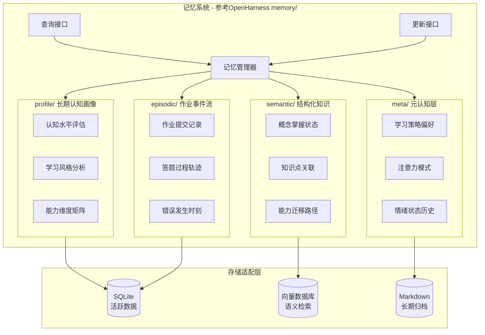

#### 3.2.2 记忆数据结构

```typescript
// Profile 长期认知画像
interface StudentProfile {
  studentId: string;
  version: number;
  lastUpdated: number;
  
  // 认知水平
  cognitiveLevel: {
    overall: number;           // 整体认知水平 1-10
    bySubject: Record<Subject, number>;
    byDimension: {
      comprehension: number;   // 理解能力
      application: number;     // 应用能力
      analysis: number;        // 分析能力
      synthesis: number;       // 综合能力
    };
  };
  
  // 学习风格
  learningStyle: {
    visual: number;            // 视觉型 0-1
    auditory: number;          // 听觉型 0-1
    kinesthetic: number;       // 动觉型 0-1
    preference: 'visual' | 'auditory' | 'kinesthetic' | 'mixed';
  };
  
  // 能力维度矩阵
  competencyMatrix: {
    conceptId: string;
    masteryLevel: number;      // 掌握程度 0-1
    stability: number;         // 稳定性 0-1
    lastAssessed: number;
  }[];
}

// Episodic 作业事件流
interface LearningEpisode {
  episodeId: string;
  studentId: string;
  timestamp: number;
  type: EpisodeType;
  
  // 事件上下文
  context: {
    homeworkId: string;
    problemId: string;
    subject: Subject;
    difficulty: number;
  };
  
  // 事件详情
  details: {
    timeSpent: number;         // 耗时（秒）
    attempts: number;          // 尝试次数
    hintsUsed: number;         // 使用提示次数
    finalResult: 'correct' | 'incorrect' | 'abandoned';
    errorType?: ErrorType;
    errorStep?: number;        // 错误发生的步骤
  };
  
  // 认知状态快照
  cognitiveSnapshot: {
    confidence: number;        // 当时自信度
    attention: number;         // 注意力水平
    fatigue: number;           // 疲劳程度
  };
}

// Semantic 结构化知识
interface SemanticKnowledge {
  studentId: string;
  
  // 概念掌握图谱
  conceptMastery: {
    conceptId: string;
    conceptName: string;
    masteryLevel: number;      // 0-1
    confidence: number;        // 置信度
    evidence: string[];        // 支持证据
    relatedConcepts: string[]; // 关联概念
  }[];
  
  // 知识路径
  knowledgePaths: {
    fromConcept: string;
    toConcept: string;
    transferStrength: number;  // 迁移强度
    evidenceCount: number;
  }[];
  
  // 薄弱点分析
  weakPoints: {
    conceptId: string;
    severity: number;          // 严重程度
    occurrenceCount: number;   // 发生次数
    lastOccurrence: number;    // 最近发生时间
    relatedErrors: string[];   // 相关错误类型
  }[];
}

// Meta 元认知层
interface MetaCognition {
  studentId: string;
  
  // 学习策略偏好
  learningStrategies: {
    strategy: string;
    frequency: number;         // 使用频率
    effectiveness: number;     // 有效性评分
  }[];
  
  // 注意力模式
  attentionPattern: {
    peakHours: number[];       // 高效时段
    averageSessionLength: number;
    attentionDecayRate: number;
  };
  
  // 情绪状态历史
  emotionalHistory: {
    timestamp: number;
    state: 'frustrated' | 'confident' | 'neutral' | 'excited';
    trigger: string;
    intensity: number;
  }[];
}
```

#### 3.2.3 记忆管理器实现

```python
class MemoryManager:
    """学生记忆管理器 - 参考OpenHarness memory/设计"""
    
    def __init__(self, storage_adapter: StorageAdapter):
        self.profile_store = ProfileStore(storage_adapter)
        self.episodic_store = EpisodicStore(storage_adapter)
        self.semantic_store = SemanticStore(storage_adapter)
        self.meta_store = MetaStore(storage_adapter)
    
    async def get_student_profile(self, student_id: str) -> StudentProfile:
        """获取学生认知画像"""
        return await self.profile_store.get(student_id)
    
    async def record_episode(self, episode: LearningEpisode):
        """记录学习事件"""
        # 1. 存储事件
        await self.episodic_store.append(episode.student_id, episode)
        
        # 2. 更新语义知识
        await self._update_semantic_knowledge(episode)
        
        # 3. 更新元认知
        await self._update_meta_cognition(episode)
        
        # 4. 触发画像更新（异步）
        asyncio.create_task(self._update_profile(episode.student_id))
    
    async def query_knowledge_state(self, student_id: str, 
                                    concept_ids: List[str]) -> Dict[str, float]:
        """查询知识状态"""
        semantic = await self.semantic_store.get(student_id)
        
        result = {}
        for concept_id in concept_ids:
            concept = next(
                (c for c in semantic.concept_mastery if c.concept_id == concept_id),
                None
            )
            result[concept_id] = concept.mastery_level if concept else 0.0
        
        return result
    
    async def get_weak_points(self, student_id: str, 
                              limit: int = 5) -> List[WeakPoint]:
        """获取薄弱点列表"""
        semantic = await self.semantic_store.get(student_id)
        
        # 按严重程度排序
        weak_points = sorted(
            semantic.weak_points,
            key=lambda w: (w.severity, w.occurrence_count),
            reverse=True
        )
        
        return weak_points[:limit]
    
    async def _update_semantic_knowledge(self, episode: LearningEpisode):
        """根据事件更新语义知识"""
        semantic = await self.semantic_store.get(episode.student_id)
        
        # 更新概念掌握状态
        for concept_id in episode.context.concept_ids:
            concept = next(
                (c for c in semantic.concept_mastery if c.concept_id == concept_id),
                None
            )
            
            if concept:
                # 使用贝叶斯更新
                concept.mastery_level = self._bayesian_update(
                    concept.mastery_level,
                    episode.details.final_result == 'correct'
                )
                concept.evidence.append(episode.episode_id)
            else:
                # 新建概念记录
                semantic.concept_mastery.append(ConceptMastery(
                    concept_id=concept_id,
                    mastery_level=1.0 if episode.details.final_result == 'correct' else 0.0,
                    evidence=[episode.episode_id]
                ))
        
        await self.semantic_store.save(episode.student_id, semantic)
    
    def _bayesian_update(self, prior: float, success: bool) -> float:
        """贝叶斯更新掌握程度"""
        # 简化的贝叶斯更新
        alpha = 2 if success else 1
        beta = 1 if success else 2
        return (prior * alpha) / (prior * alpha + (1 - prior) * beta)
```

### 3.3 变形题生成引擎设计

#### 3.3.1 架构图

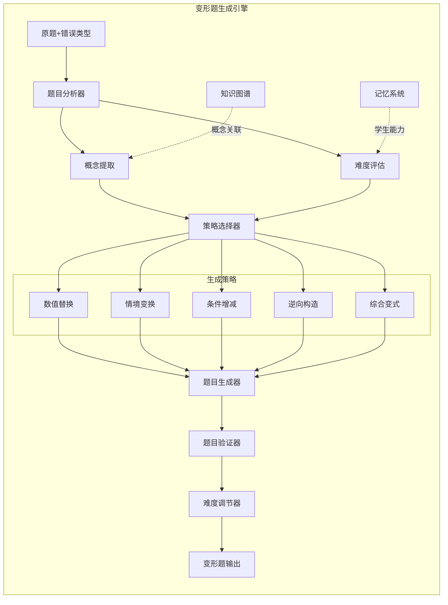

#### 3.3.2 生成策略矩阵

| 错误类型 | 主要策略 | 次要策略 | 难度调节 |
|---------|---------|---------|---------|
| 概念误解 | 情境变换 | 条件增减 | -1 |
| 计算错误 | 数值替换 | 逆向构造 | 0 |
| 逻辑漏洞 | 逆向构造 | 综合变式 | +1 |
| 粗心错误 | 数值替换 | 情境变换 | 0 |
| 知识缺口 | 条件增减 | 综合变式 | -2 |

#### 3.3.3 分层生成流程

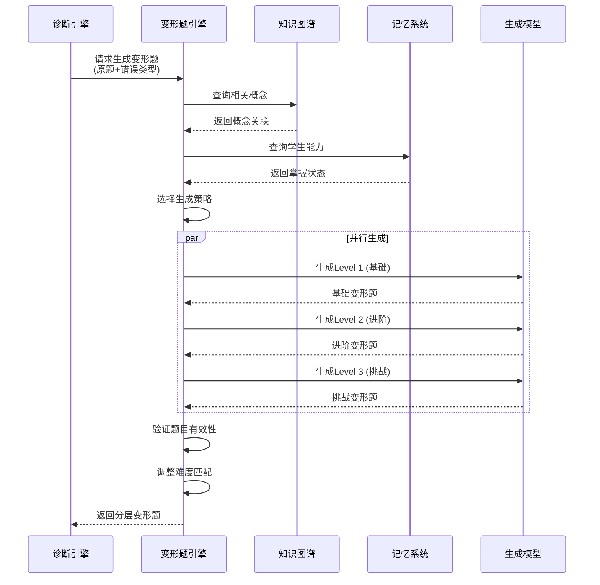

#### 3.3.4 核心实现

```python
class VariantGenerator:
    """变形题生成引擎"""
    
    GENERATION_STRATEGIES = {
        ErrorType.CONCEPT_MISUNDERSTANDING: ['context_change', 'condition_modify'],
        ErrorType.CALCULATION_ERROR: ['value_substitution', 'reverse_construct'],
        ErrorType.LOGICAL_FLAW: ['reverse_construct', 'comprehensive'],
        ErrorType.CARELESS_MISTAKE: ['value_substitution', 'context_change'],
        ErrorType.KNOWLEDGE_GAP: ['condition_modify', 'comprehensive'],
    }
    
    DIFFICULTY_ADJUSTMENT = {
        ErrorType.CONCEPT_MISUNDERSTANDING: -1,
        ErrorType.CALCULATION_ERROR: 0,
        ErrorType.LOGICAL_FLAW: 1,
        ErrorType.CARELESS_MISTAKE: 0,
        ErrorType.KNOWLEDGE_GAP: -2,
    }
    
    def __init__(self, model_client: ModelClient, 
                 knowledge_graph: KnowledgeGraphService,
                 memory_manager: MemoryManager):
        self.model = model_client
        self.kg = knowledge_graph
        self.memory = memory_manager
    
    async def generate_variants(
        self,
        student_id: str,
        original_problem: Problem,
        error_type: ErrorType,
        count: int = 3
    ) -> List[VariantProblem]:
        """生成分层变形题"""
        
        # 1. 获取学生能力状态
        student_level = await self._get_student_level(student_id)
        
        # 2. 选择生成策略
        strategies = self.GENERATION_STRATEGIES[error_type]
        
        # 3. 确定难度层级
        base_difficulty = original_problem.difficulty
        adjustment = self.DIFFICULTY_ADJUSTMENT[error_type]
        
        variants = []
        for i in range(count):
            target_difficulty = self._calculate_target_difficulty(
                base_difficulty, adjustment, i, student_level
            )
            
            variant = await self._generate_single_variant(
                original_problem=original_problem,
                error_type=error_type,
                strategy=strategies[i % len(strategies)],
                target_difficulty=target_difficulty,
                student_level=student_level
            )
            
            variants.append(variant)
        
        return variants
    
    async def _generate_single_variant(
        self,
        original_problem: Problem,
        error_type: ErrorType,
        strategy: str,
        target_difficulty: int,
        student_level: float
    ) -> VariantProblem:
        """生成单个变形题"""
        
        # 构建生成提示
        prompt = self._build_generation_prompt(
            original_problem=original_problem,
            error_type=error_type,
            strategy=strategy,
            target_difficulty=target_difficulty,
            student_level=student_level
        )
        
        # 调用模型生成
        response = await self.model.generate(
            prompt=prompt,
            temperature=0.7,
            max_tokens=2000
        )
        
        # 解析并验证
        variant = self._parse_variant(response)
        validated = await self._validate_variant(variant, original_problem)
        
        if not validated:
            # 重试一次
            variant = await self._generate_single_variant(
                original_problem, error_type, strategy, 
                target_difficulty - 1, student_level
            )
        
        return variant
    
    def _build_generation_prompt(
        self,
        original_problem: Problem,
        error_type: ErrorType,
        strategy: str,
        target_difficulty: int,
        student_level: float
    ) -> str:
        """构建生成提示"""
        
        strategy_descriptions = {
            'value_substitution': '替换题目中的数值，保持解题方法不变',
            'context_change': '改变题目情境，保持核心概念不变',
            'condition_modify': '增加或减少题目条件',
            'reverse_construct': '逆向构造问题（已知结果求条件）',
            'comprehensive': '综合多个概念的综合题',
        }
        
        return f"""
你是一位资深的中学数学/物理/化学教师，擅长设计针对性的练习题。

【原题】
{original_problem.content}

【学生错误分析】
- 错误类型: {error_type.value}
- 学生当前水平: {student_level:.0%}
- 目标难度: {target_difficulty}/10

【生成策略】
{strategy_descriptions[strategy]}

【要求】
1. 生成的题目必须针对学生的错误类型
2. 难度严格控制在 {target_difficulty}/10
3. 题目表述清晰，无歧义
4. 提供解题提示
5. 标注预期解题步骤数

【输出格式】
{{
    "content": "题目内容",
    "difficulty": {target_difficulty},
    "target_concept": "针对的概念",
    "hint": "提示信息",
    "expected_steps": 步骤数
}}
"""
```

### 3.4 诊断流程引擎设计

#### 3.4.1 90秒闭环流程

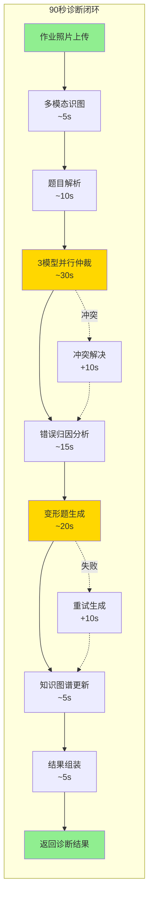

#### 3.4.2 状态机设计

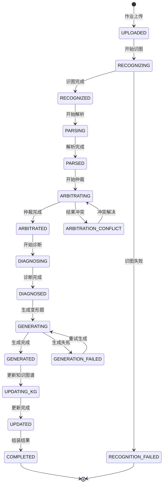

#### 3.4.3 核心实现

```python
class DiagnosisEngine:
    """诊断流程引擎 - 90秒闭环"""
    
    TIMEOUT_SECONDS = 90
    
    def __init__(
        self,
        vision_service: VisionService,
        arbitration_engine: ArbitrationEngine,
        variant_generator: VariantGenerator,
        memory_manager: MemoryManager,
        knowledge_graph: KnowledgeGraphService
    ):
        self.vision = vision_service
        self.arbitration = arbitration_engine
        self.variant_gen = variant_generator
        self.memory = memory_manager
        self.kg = knowledge_graph
    
    async def diagnose(
        self,
        student_id: str,
        image_base64: str,
        parent_description: Optional[str] = None
    ) -> DiagnosisResult:
        """执行完整诊断流程"""
        
        start_time = time.time()
        task_id = generate_task_id()
        
        try:
            # 1. 多模态识图 (~5s)
            recognized = await self._recognize_image(
                image_base64, parent_description
            )
            
            # 2. 题目解析 (~10s)
            problems = await self._parse_problems(recognized)
            
            # 3. 并行处理每道题目
            diagnosis_tasks = [
                self._diagnose_single_problem(student_id, problem)
                for problem in problems
            ]
            problem_diagnoses = await asyncio.gather(*diagnosis_tasks)
            
            # 4. 识别错题
            wrong_problems = [
                pd for pd in problem_diagnoses
                if pd.is_wrong
            ]
            
            # 5. 为错题生成变形题 (~20s)
            variants = await self._generate_variants_for_wrong(
                student_id, wrong_problems
            )
            
            # 6. 更新知识图谱 (~5s)
            await self._update_knowledge_graph(student_id, problem_diagnoses)
            
            # 7. 记录学习事件
            await self._record_episode(student_id, task_id, problem_diagnoses)
            
            # 8. 组装结果
            result = DiagnosisResult(
                task_id=task_id,
                original_problems=problems,
                wrong_problems=wrong_problems,
                generated_variants=variants,
                knowledge_update=await self._get_knowledge_update(student_id),
                processing_time=time.time() - start_time
            )
            
            return result
            
        except TimeoutError:
            return DiagnosisResult(
                task_id=task_id,
                status='timeout',
                error=DiagnosisError(
                    code='TIMEOUT',
                    message='诊断超时，请重试',
                    retryable=True
                )
            )
        except Exception as e:
            logger.error(f"Diagnosis failed: {e}")
            return DiagnosisResult(
                task_id=task_id,
                status='failed',
                error=DiagnosisError(
                    code='INTERNAL_ERROR',
                    message='诊断失败，请稍后重试',
                    retryable=True
                )
            )
    
    async def _diagnose_single_problem(
        self,
        student_id: str,
        problem: Problem
    ) -> ProblemDiagnosis:
        """诊断单道题目"""
        
        # 获取学生历史表现
        student_history = await self.memory.get_student_profile(student_id)
        
        # 多模型仲裁
        arbitration_result = await self.arbitration.arbitrate(problem)
        
        # 判断是否正确
        is_correct = arbitration_result.confidence > 0.8 and \
                     arbitration_result.diagnosis.is_correct
        
        if is_correct:
            return ProblemDiagnosis(
                problem_id=problem.id,
                is_wrong=False,
                confidence=arbitration_result.confidence
            )
        
        # 错误归因分析
        root_cause = self._analyze_root_cause(
            arbitration_result, student_history
        )
        
        return ProblemDiagnosis(
            problem_id=problem.id,
            is_wrong=True,
            error_type=root_cause.error_type,
            root_cause=root_cause.description,
            concept_gap=root_cause.concept_gaps,
            confidence=arbitration_result.confidence
        )
    
    async def _generate_variants_for_wrong(
        self,
        student_id: str,
        wrong_problems: List[ProblemDiagnosis]
    ) -> List[VariantProblem]:
        """为错题生成变形题"""
        
        variant_tasks = []
        for wp in wrong_problems:
            original = await self._get_problem_by_id(wp.problem_id)
            task = self.variant_gen.generate_variants(
                student_id=student_id,
                original_problem=original,
                error_type=wp.error_type,
                count=2  # 每道错题生成2道变形题
            )
            variant_tasks.append(task)
        
        variant_lists = await asyncio.gather(*variant_tasks)
        return [v for vl in variant_lists for v in vl]
    
    def _analyze_root_cause(
        self,
        arbitration_result: ArbitrationResult,
        student_history: StudentProfile
    ) -> RootCause:
        """分析错误根本原因"""
        
        # 结合仲裁结果和学生历史进行归因
        model_votes = arbitration_result.model_votes
        
        # 统计各错误类型的投票
        error_type_votes = defaultdict(float)
        for model_id, diagnosis in model_votes.items():
            weight = self.arbitration.MODEL_WEIGHTS[model_id]
            error_type_votes[diagnosis.error_type] += weight
        
        # 选择得票最高的错误类型
        primary_error = max(error_type_votes.items(), key=lambda x: x[1])
        
        # 分析概念缺口
        concept_gaps = self._identify_concept_gaps(
            arbitration_result.diagnosis,
            student_history
        )
        
        return RootCause(
            error_type=primary_error[0],
            description=arbitration_result.diagnosis.root_cause,
            concept_gaps=concept_gaps
        )
```

---

## 4. 技术选型说明

### 4.1 技术栈分层

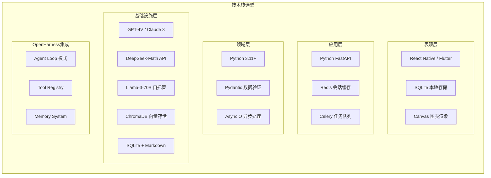

### 4.2 技术选型理由

| 层级 | 技术选型 | 选择理由 |
|------|---------|---------|
| **表现层** | React Native | 跨平台(iOS/Android)，热更新，社区活跃 |
| **表现层** | SQLite | 轻量级本地存储，零配置，支持复杂查询 |
| **应用层** | FastAPI | 高性能异步框架，自动API文档，类型提示 |
| **应用层** | Redis | 会话管理，速率限制，缓存热点数据 |
| **应用层** | Celery | 异步任务队列，支持定时任务和重试机制 |
| **领域层** | Python 3.11+ | AI/ML生态完善，异步支持好，开发效率高 |
| **领域层** | Pydantic | 运行时类型验证，序列化，配置管理 |
| **基础设施** | GPT-4V | 最强多模态识图能力 |
| **基础设施** | DeepSeek-Math | 数学推理专用，性价比高 |
| **基础设施** | Llama-3-70B | 开源可自托管，隐私可控，成本低 |
| **基础设施** | ChromaDB | 轻量级向量数据库，易集成，支持语义搜索 |

### 4.3 OpenHarness集成点

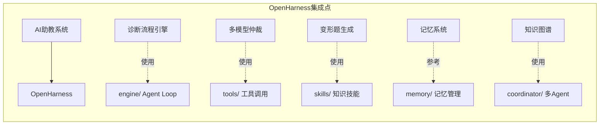

#### 4.3.1 集成实现

```python
# OpenHarness集成配置
OPENHARNESS_INTEGRATION = {
    # Agent Loop 集成
    "engine": {
        "enabled": True,
        "mode": "embedded",  # embedded / standalone
        "hooks": {
            "pre_tool_use": "ai_tutor.hooks.pre_tool_use",
            "post_tool_use": "ai_tutor.hooks.post_tool_use",
        }
    },
    
    # 工具注册
    "tools": {
        "custom_tools": [
            "ai_tutor.tools.diagnose_problem",
            "ai_tutor.tools.generate_variant",
            "ai_tutor.tools.update_knowledge_graph",
        ],
        "inherit_core": True,
    },
    
    # 技能系统
    "skills": {
        "skill_paths": [
            "./skills/math_problem_solving",
            "./skills/physics_analysis",
            "./skills/chemistry_reasoning",
        ],
        "auto_load": True,
    },
    
    # 记忆系统
    "memory": {
        "adapter": "ai_tutor.memory.StudentMemoryAdapter",
        "sync_interval": 300,  # 5分钟同步
    },
    
    # MCP协议
    "mcp": {
        "enabled": True,
        "servers": [
            {"name": "knowledge_graph", "url": "http://localhost:8001"},
            {"name": "variant_generator", "url": "http://localhost:8002"},
        ]
    }
}
```

---

## 5. 数据流设计

### 5.1 核心数据流

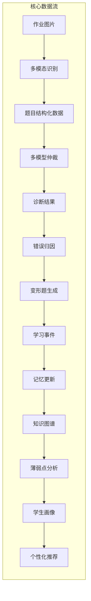

### 5.2 控制流设计

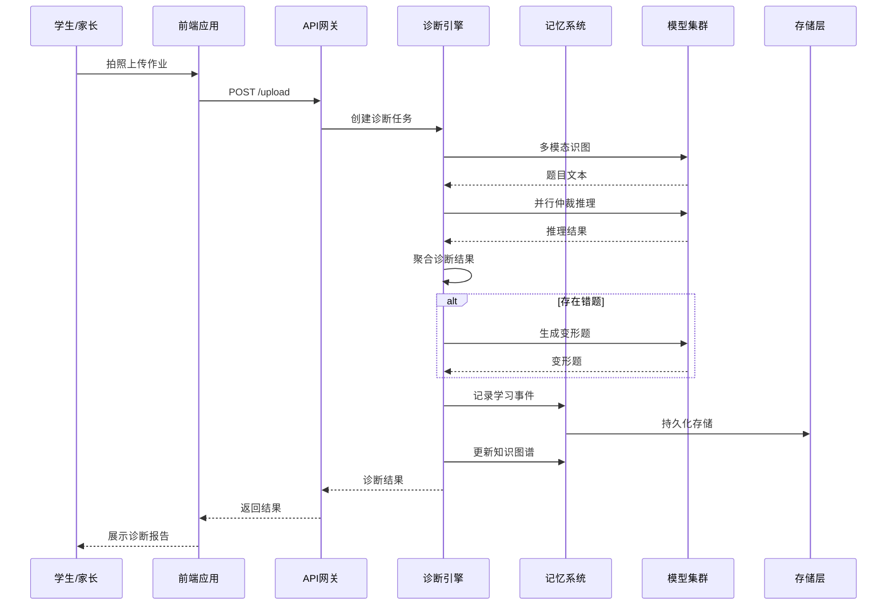

---

## 6. 部署架构

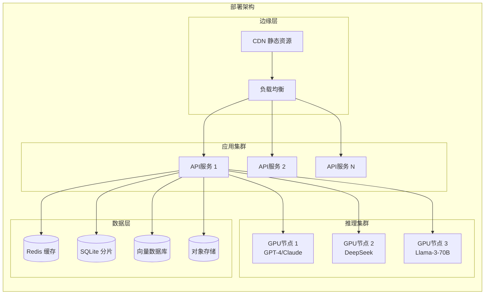

---

## 7. 总结

### 7.1 架构设计要点

1. **分层清晰**：表现层/应用层/领域层/基础设施层职责明确
2. **90秒闭环**：诊断流程严格控制在90秒内完成
3. **多模型仲裁**：3模型加权聚合，提高诊断准确性
4. **OpenHarness集成**：参考其Agent Loop、Memory、Tool等设计
5. **记忆系统**：4层记忆结构（Profile/Episodic/Semantic/Meta）
6. **变形题生成**：基于错误类型的分层生成策略

### 7.2 关键指标

| 指标 | 目标值 | 说明 |
|------|-------|------|
| 诊断响应时间 | < 90s | 端到端诊断闭环 |
| 识图准确率 | > 95% | 多模态识别准确率 |
| 仲裁置信度 | > 0.85 | 多模型一致率 |
| 变形题有效性 | > 90% | 题目通过验证率 |
| 系统可用性 | > 99.9% | 年度可用性 |

---

*文档结束*
