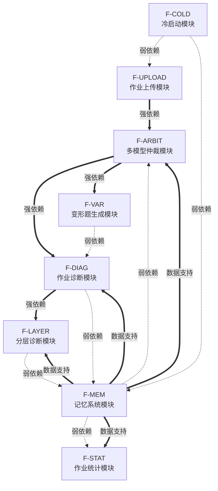
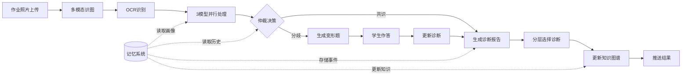

# AI助教系统 - 功能模块详细设计

> 文档版本：v1.0  
> 功能追溯ID格式：F-模块-序号（如 F-UPLOAD-001）  
> 功能颗粒度：1-3人天可完成  

---

## 目录

1. [功能模块总览](#一功能模块总览)
2. [作业上传模块 (F-UPLOAD)](#二作业上传模块-f-upload)
3. [多模型仲裁模块 (F-ARBIT)](#三多模型仲裁模块-f-arbit)
4. [作业诊断模块 (F-DIAG)](#四作业诊断模块-f-diag)
5. [变形题生成模块 (F-VAR)](#五变形题生成模块-f-var)
6. [分层诊断模块 (F-LAYER)](#六分层诊断模块-f-layer)
7. [记忆系统模块 (F-MEM)](#七记忆系统模块-f-mem)
8. [作业统计模块 (F-STAT)](#八作业统计模块-f-stat)
9. [冷启动模块 (F-COLD)](#九冷启动模块-f-cold)
10. [功能依赖关系图](#十功能依赖关系图)
11. [MVP功能清单](#十一mvp功能清单)

---

## 一、功能模块总览

| 模块ID | 模块名称 | 功能数量 | 优先级 | 预估人天 |
|--------|----------|----------|--------|----------|
| F-UPLOAD | 作业上传模块 | 6 | P0 | 8 |
| F-ARBIT | 多模型仲裁模块 | 7 | P0 | 12 |
| F-DIAG | 作业诊断模块 | 8 | P0 | 14 |
| F-VAR | 变形题生成模块 | 5 | P0 | 10 |
| F-LAYER | 分层诊断模块 | 6 | P0 | 10 |
| F-MEM | 记忆系统模块 | 8 | P1 | 12 |
| F-STAT | 作业统计模块 | 6 | P1 | 10 |
| F-COLD | 冷启动模块 | 5 | P1 | 8 |

**总计：51个功能点，预估84人天**

---

## 二、作业上传模块 (F-UPLOAD)

### 模块概述
负责处理作业照片的接收、预处理、存储，以及家长描述的解析。

### 功能清单

#### F-UPLOAD-001：拍照上传接口
| 属性 | 内容 |
|------|------|
| **功能名称** | 拍照上传接口 |
| **功能描述** | 接收用户通过相机拍摄的作业照片，支持单张/多张上传，进行基础格式校验 |
| **输入** | 图片文件（JPG/PNG，单张≤10MB），用户ID，学科类型 |
| **输出** | 上传任务ID，临时存储路径，预处理状态 |
| **前置条件** | 用户已登录，相机权限已获取 |
| **后置条件** | 图片存入临时存储，触发预处理任务 |
| **异常处理** | 格式错误→返回错误码E001；大小超限→返回错误码E002；网络中断→支持断点续传 |
| **优先级** | P0 |

**验收标准**：
- [ ] 支持JPG/PNG格式，单张≤10MB
- [ ] 单次最多上传5张照片
- [ ] 上传成功率≥99%（网络正常）
- [ ] 上传响应时间≤3秒（4G网络）

---

#### F-UPLOAD-002：相册选择上传
| 属性 | 内容 |
|------|------|
| **功能名称** | 相册选择上传 |
| **功能描述** | 从手机相册选择已有照片上传，支持多选和预览 |
| **输入** | 相册图片URI列表，用户ID，学科类型 |
| **输出** | 上传任务ID列表，每张图片的预处理状态 |
| **前置条件** | 用户已登录，相册读取权限已获取 |
| **后置条件** | 图片复制到临时存储，触发预处理任务 |
| **异常处理** | 图片损坏→跳过并提示；权限拒绝→引导开启权限 |
| **优先级** | P0 |

**验收标准**：
- [ ] 支持iOS/Android相册读取
- [ ] 多选上限5张
- [ ] 预览功能支持缩放查看
- [ ] 损坏图片识别率≥95%

---

#### F-UPLOAD-003：图片预处理（压缩/去噪）
| 属性 | 内容 |
|------|------|
| **功能名称** | 图片预处理 |
| **功能描述** | 对上传图片进行压缩、去噪、方向校正，优化OCR识别效果 |
| **输入** | 原始图片文件，预处理配置参数 |
| **输出** | 处理后图片文件，处理日志（压缩比、去噪强度） |
| **前置条件** | 图片已完成上传存储 |
| **后置条件** | 处理后图片存入处理队列，等待OCR识别 |
| **异常处理** | 处理失败→标记为待人工处理；超时→重试3次后告警 |
| **优先级** | P0 |

**验收标准**：
- [ ] 压缩后图片≤2MB，清晰度保持≥90%
- [ ] 处理时间≤2秒/张
- [ ] 文字区域识别准确率≥95%
- [ ] 支持自动旋转校正

---

#### F-UPLOAD-004：家长描述输入框
| 属性 | 内容 |
|------|------|
| **功能名称** | 家长描述输入框 |
| **功能描述** | 提供文本输入框供家长描述作业情况，限制140字，支持语音转文字 |
| **输入** | 文本内容（≤140字）或语音文件 |
| **输出** | 描述文本，字数统计，情感标签（AI分析） |
| **前置条件** | 图片上传完成或用户选择跳过 |
| **后置条件** | 描述文本与作业绑定，触发AI解析 |
| **异常处理** | 超字数→截断并提示；敏感词→过滤并提示 |
| **优先级** | P0 |

**验收标准**：
- [ ] 字数限制140字，实时显示剩余字数
- [ ] 语音转文字准确率≥85%
- [ ] 敏感词过滤覆盖率100%
- [ ] 输入响应延迟≤100ms

---

#### F-UPLOAD-005：AI解析家长描述
| 属性 | 内容 |
|------|------|
| **功能名称** | AI解析家长描述 |
| **功能描述** | 解析家长描述文本，提取关键信息（学科、题型、难度感知、孩子状态） |
| **输入** | 家长描述文本，学生ID |
| **输出** | 结构化标签（学科/题型/难度/状态），置信度分数 |
| **前置条件** | 家长描述已提交 |
| **后置条件** | 解析结果存入作业元数据，供诊断模块使用 |
| **异常处理** | 解析失败→使用默认标签；置信度低→标记待确认 |
| **优先级** | P1 |

**验收标准**：
- [ ] 学科识别准确率≥90%
- [ ] 题型识别准确率≥80%
- [ ] 难度感知提取准确率≥75%
- [ ] 解析响应时间≤1秒

---

#### F-UPLOAD-006：作业提交确认
| 属性 | 内容 |
|------|------|
| **功能名称** | 作业提交确认 |
| **功能描述** | 汇总上传内容和解析结果，展示给用户确认后正式提交 |
| **输入** | 图片列表，解析结果，家长描述 |
| **输出** | 确认页面HTML，提交结果（成功/失败） |
| **前置条件** | 图片预处理完成，描述解析完成 |
| **后置条件** | 作业状态更新为"待诊断"，触发多模型仲裁 |
| **异常处理** | 提交失败→保留草稿，支持重试；超时→自动保存草稿 |
| **优先级** | P0 |

**验收标准**：
- [ ] 确认页面加载时间≤1秒
- [ ] 提交成功率≥99.5%
- [ ] 草稿自动保存间隔30秒
- [ ] 支持提交前编辑修改

---

## 三、多模型仲裁模块 (F-ARBIT)

### 模块概述
协调三个AI模型并行处理，通过仲裁机制确定最终诊断结果。

### 功能清单

#### F-ARBIT-001：模型A调度（通用大模型）
| 属性 | 内容 |
|------|------|
| **功能名称** | 模型A调度（通用大模型） |
| **功能描述** | 调用通用大模型进行题目解构和考点分类 |
| **输入** | 预处理后的图片，OCR文本，学科类型 |
| **输出** | 题目类型标签，考点列表，解构置信度 |
| **前置条件** | 作业已提交，OCR识别完成 |
| **后置条件** | 模型A结果存入仲裁队列 |
| **异常处理** | 调用失败→重试2次后标记失败；超时→返回部分结果 |
| **优先级** | P0 |

**验收标准**：
- [ ] 调用成功率≥98%
- [ ] 响应时间≤5秒（P95）
- [ ] 题目类型识别准确率≥90%
- [ ] 考点覆盖率≥85%

---

#### F-ARBIT-002：模型B调度（理科专用模型）
| 属性 | 内容 |
|------|------|
| **功能名称** | 模型B调度（理科专用模型） |
| **功能描述** | 调用理科专用模型进行逻辑推演和步骤验证 |
| **输入** | 预处理后的图片，OCR文本，学生答案 |
| **输出** | 解题步骤序列，每步正确性判断，错误步骤定位 |
| **前置条件** | 作业已提交，OCR识别完成 |
| **后置条件** | 模型B结果存入仲裁队列 |
| **异常处理** | 调用失败→重试2次后标记失败；复杂题超时→分段返回 |
| **优先级** | P0 |

**验收标准**：
- [ ] 调用成功率≥98%
- [ ] 响应时间≤8秒（P95）
- [ ] 步骤正确性判断准确率≥85%
- [ ] 错误步骤定位准确率≥80%

---

#### F-ARBIT-003：模型C调度（开源验证模型）
| 属性 | 内容 |
|------|------|
| **功能名称** | 模型C调度（开源验证模型） |
| **功能描述** | 调用开源验证模型进行概念映射和归因交叉验证 |
| **输入** | 预处理后的图片，OCR文本，模型A/B的中间结果 |
| **输出** | 概念映射关系，错误归因标签，验证置信度 |
| **前置条件** | 作业已提交，OCR识别完成 |
| **后置条件** | 模型C结果存入仲裁队列 |
| **异常处理** | 调用失败→使用模型A/B结果；超时→返回简化结果 |
| **优先级** | P0 |

**验收标准**：
- [ ] 调用成功率≥95%
- [ ] 响应时间≤6秒（P95）
- [ ] 概念映射准确率≥80%
- [ ] 归因一致性≥75%

---

#### F-ARBIT-004：并行任务协调器
| 属性 | 内容 |
|------|------|
| **功能名称** | 并行任务协调器 |
| **功能描述** | 并行调度三个模型，管理任务队列，监控执行状态 |
| **输入** | 作业ID，模型调用配置，超时设置 |
| **输出** | 任务执行状态，各模型返回结果，超时告警 |
| **前置条件** | 作业状态为"待诊断" |
| **后置条件** | 三个模型结果就绪，触发仲裁逻辑 |
| **异常处理** | 模型超时→标记为不可用；队列满→排队等待 |
| **优先级** | P0 |

**验收标准**：
- [ ] 并行调度成功率≥99%
- [ ] 任务排队延迟≤500ms
- [ ] 支持同时处理≥100个作业
- [ ] 超时检测精度±1秒

---

#### F-ARBIT-005：仲裁决策引擎
| 属性 | 内容 |
|------|------|
| **功能名称** | 仲裁决策引擎 |
| **功能描述** | 根据三模型结果进行仲裁，共识≥2/3采用多数结果，全部分歧触发变形题 |
| **输入** | 模型A/B/C的结果，置信度分数，历史准确率权重 |
| **输出** | 仲裁结果（采纳/分歧），最终诊断，分歧标记 |
| **前置条件** | 三个模型结果均已返回 |
| **后置条件** | 仲裁结果输出，分歧时触发变形题生成 |
| **异常处理** | 单模型失败→使用剩余两模型结果；全失败→返回人工审核 |
| **优先级** | P0 |

**验收标准**：
- [ ] 仲裁决策时间≤500ms
- [ ] 共识判断准确率≥95%
- [ ] 分歧识别率≥90%
- [ ] 仲裁结果可追溯

---

#### F-ARBIT-006：结果融合算法
| 属性 | 内容 |
|------|------|
| **功能名称** | 结果融合算法 |
| **功能描述** | 将多个模型的结果融合为统一的诊断输出，处理冲突和补充信息 |
| **输入** | 多模型结果，置信度权重，历史融合策略 |
| **输出** | 融合后的诊断报告，各字段来源标记 |
| **前置条件** | 仲裁决策完成 |
| **后置条件** | 融合结果输出，进入诊断展示流程 |
| **异常处理** | 冲突无法解决→标记高优先级人工审核 |
| **优先级** | P0 |

**验收标准**：
- [ ] 融合时间≤300ms
- [ ] 冲突解决率≥85%
- [ ] 结果一致性≥90%
- [ ] 来源标记准确率100%

---

#### F-ARBIT-007：模型性能监控
| 属性 | 内容 |
|------|------|
| **功能名称** | 模型性能监控 |
| **功能描述** | 监控各模型的响应时间、准确率、可用性，动态调整权重 |
| **输入** | 模型调用日志，人工审核反馈，正确率统计 |
| **输出** | 模型性能报表，权重调整建议，告警信息 |
| **前置条件** | 系统运行中，有历史数据 |
| **后置条件** | 权重参数更新，告警通知发送 |
| **异常处理** | 模型性能骤降→自动降级；监控失效→使用默认权重 |
| **优先级** | P1 |

**验收标准**：
- [ ] 监控数据采集延迟≤1分钟
- [ ] 准确率统计误差≤2%
- [ ] 告警触发时间≤5分钟
- [ ] 权重调整生效时间≤10分钟

---

## 四、作业诊断模块 (F-DIAG)

### 模块概述
基于仲裁结果生成错题诊断报告，提供启发式讲解。

### 功能清单

#### F-DIAG-001：错题识别与定位
| 属性 | 内容 |
|------|------|
| **功能名称** | 错题识别与定位 |
| **功能描述** | 识别作业中的错题，定位错误位置，标记错误类型 |
| **输入** | 融合诊断结果，标准答案，学生答案 |
| **输出** | 错题列表（题号/位置/类型），错误截图坐标 |
| **前置条件** | 仲裁结果已输出 |
| **后置条件** | 错题信息存入诊断报告 |
| **异常处理** | 答案无法识别→标记待确认；多解情况→列出可能 |
| **优先级** | P0 |

**验收标准**：
- [ ] 错题识别准确率≥95%
- [ ] 位置定位误差≤5像素
- [ ] 错误类型分类准确率≥90%
- [ ] 处理时间≤1秒

---

#### F-DIAG-002：错误归因分析
| 属性 | 内容 |
|------|------|
| **功能名称** | 错误归因分析 |
| **功能描述** | 分析错误原因，归类为知识缺口/粗心/理解偏差等 |
| **输入** | 错题信息，学生历史数据，知识点图谱 |
| **输出** | 归因标签，置信度，相关知识点 |
| **前置条件** | 错题识别完成 |
| **后置条件** | 归因结果用于生成讲解内容 |
| **异常处理** | 归因不确定→提供多种可能；无历史数据→使用通用归因 |
| **优先级** | P0 |

**验收标准**：
- [ ] 归因准确率≥80%
- [ ] 归因类别覆盖率≥90%
- [ ] 相关知识点召回率≥85%
- [ ] 分析时间≤2秒

---

#### F-DIAG-003：启发式讲解生成
| 属性 | 内容 |
|------|------|
| **功能名称** | 启发式讲解生成 |
| **功能描述** | 基于错误归因生成有趣的类比讲解，使用生活化例子 |
| **输入** | 错误归因，知识点信息，学生年龄段，偏好设置 |
| **输出** | 讲解文本，类比例子，分步提示 |
| **前置条件** | 归因分析完成 |
| **后置条件** | 讲解内容存入诊断报告，展示给用户 |
| **异常处理** | 生成失败→使用模板讲解；超时→返回简化版 |
| **优先级** | P0 |

**验收标准**：
- [ ] 讲解生成时间≤3秒
- [ ] 类比恰当性评分≥4.0/5.0（人工评估）
- [ ] 年龄段适配准确率≥90%
- [ ] 内容安全性100%

---

#### F-DIAG-004：解题步骤拆解
| 属性 | 内容 |
|------|------|
| **功能名称** | 解题步骤拆解 |
| **功能描述** | 将正确解题过程拆解为可理解的步骤，标注关键节点 |
| **输入** | 标准解题过程，知识点分解，难度分级 |
| **输出** | 步骤列表（序号/内容/关键提示），步骤依赖图 |
| **前置条件** | 题目类型和考点已识别 |
| **后置条件** | 步骤信息用于讲解和变形题生成 |
| **异常处理** | 步骤过多→合并次要步骤；步骤不清晰→补充说明 |
| **优先级** | P0 |

**验收标准**：
- [ ] 步骤完整性≥95%
- [ ] 步骤逻辑正确率≥98%
- [ ] 关键节点标注准确率≥90%
- [ ] 平均步骤数≤7步

---

#### F-DIAG-005：诊断报告组装
| 属性 | 内容 |
|------|------|
| **功能名称** | 诊断报告组装 |
| **功能描述** | 将各诊断组件组装为完整的诊断报告，包含错题、归因、讲解 |
| **输入** | 错题信息，归因结果，讲解内容，步骤拆解 |
| **输出** | 完整诊断报告（JSON/HTML），报告ID |
| **前置条件** | 各诊断组件已完成 |
| **后置条件** | 报告存入数据库，触发推送通知 |
| **异常处理** | 组件缺失→使用占位符；组装失败→重试后告警 |
| **优先级** | P0 |

**验收标准**：
- [ ] 组装时间≤500ms
- [ ] 报告完整性100%
- [ ] 格式正确率100%
- [ ] 支持PDF导出

---

#### F-DIAG-006：实时推送通知
| 属性 | 内容 |
|------|------|
| **功能名称** | 实时推送通知 |
| **功能描述** | 诊断完成后实时推送给用户，支持APP推送和微信通知 |
| **输入** | 报告ID，用户ID，推送渠道配置 |
| **输出** | 推送状态（成功/失败/忽略），送达确认 |
| **前置条件** | 诊断报告已组装完成 |
| **后置条件** | 用户收到通知，可点击查看详情 |
| **异常处理** | 推送失败→重试3次；用户拒收→记录偏好 |
| **优先级** | P0 |

**验收标准**：
- [ ] 推送延迟≤5秒
- [ ] 送达率≥95%
- [ ] 点击率≥30%
- [ ] 支持免打扰时段设置

---

#### F-DIAG-007：诊断结果缓存
| 属性 | 内容 |
|------|------|
| **功能名称** | 诊断结果缓存 |
| **功能描述** | 缓存常见题目的诊断结果，加速重复查询 |
| **输入** | 题目特征哈希，诊断结果，缓存策略 |
| **输出** | 缓存命中状态，缓存内容或MISS |
| **前置条件** | 诊断报告已生成 |
| **后置条件** | 结果写入缓存，设置过期时间 |
| **异常处理** | 缓存失败→不影响主流程；缓存击穿→限流保护 |
| **优先级** | P1 |

**验收标准**：
- [ ] 缓存命中率≥60%
- [ ] 缓存读取时间≤50ms
- [ ] 缓存一致性≥99.9%
- [ ] 过期策略合理（热点7天，普通3天）

---

#### F-DIAG-008：人工审核入口
| 属性 | 内容 |
|------|------|
| **功能名称** | 人工审核入口 |
| **功能描述** | 提供用户对诊断结果的反馈入口，支持标记错误和补充信息 |
| **输入** | 用户反馈（类型/内容/截图），报告ID |
| **输出** | 反馈记录ID，处理状态，奖励积分 |
| **前置条件** | 诊断报告已展示给用户 |
| **后置条件** | 反馈存入审核队列，触发模型优化流程 |
| **异常处理** | 反馈提交失败→本地保存后重试；恶意反馈→风控拦截 |
| **优先级** | P1 |

**验收标准**：
- [ ] 反馈提交成功率≥99%
- [ ] 反馈分类准确率≥95%
- [ ] 审核响应时间≤24小时
- [ ] 有效反馈奖励发放率100%

---

## 五、变形题生成模块 (F-VAR)

### 模块概述
根据原题生成变形题，用于验证学生是否真正掌握知识点。

### 功能清单

#### F-VAR-001：数值变形生成
| 属性 | 内容 |
|------|------|
| **功能名称** | 数值变形生成 |
| **功能描述** | 将原题中的整数替换为分数/小数，保持解题逻辑不变 |
| **输入** | 原题文本，数值位置标记，变形规则配置 |
| **输出** | 变形后题目，新答案，变形类型标签 |
| **前置条件** | 原题已解析，数值位置已识别 |
| **后置条件** | 变形题存入题库，可用于测试 |
| **异常处理** | 变形后无解→重新生成；数值溢出→限制范围 |
| **优先级** | P0 |

**验收标准**：
- [ ] 变形成功率≥95%
- [ ] 答案正确率100%
- [ ] 变形后难度变化≤±20%
- [ ] 生成时间≤1秒

---

#### F-VAR-002：逆运算变形生成
| 属性 | 内容 |
|------|------|
| **功能名称** | 逆运算变形生成 |
| **功能描述** | 将原题改为已知结果求输入的逆运算题目 |
| **输入** | 原题文本，运算类型，逆运算规则 |
| **输出** | 逆运算变形题，新答案，难度系数 |
| **前置条件** | 原题运算类型已识别 |
| **后置条件** | 变形题存入题库，可用于测试 |
| **异常处理** | 逆运算不成立→跳过该类型；多解情况→标注说明 |
| **优先级** | P0 |

**验收标准**：
- [ ] 逆运算正确率≥98%
- [ ] 单解保证率≥95%
- [ ] 难度提升幅度20%-50%
- [ ] 生成时间≤1.5秒

---

#### F-VAR-003：情境迁移变形
| 属性 | 内容 |
|------|------|
| **功能名称** | 情境迁移变形 |
| **功能描述** | 将生活情境题目迁移为抽象模型，或反之 |
| **输入** | 原题文本，情境类型，目标形式（抽象/具象） |
| **输出** | 情境迁移后题目，等价性验证结果 |
| **前置条件** | 原题情境已识别 |
| **后置条件** | 变形题存入题库，可用于测试 |
| **异常处理** | 迁移后不等价→重新生成；情境不匹配→使用备选模板 |
| **优先级** | P1 |

**验收标准**：
- [ ] 等价性保持率≥95%
- [ ] 情境自然度评分≥3.5/5.0
- [ ] 迁移类型覆盖率≥80%
- [ ] 生成时间≤2秒

---

#### F-VAR-004：变形题难度评估
| 属性 | 内容 |
|------|------|
| **功能名称** | 变形题难度评估 |
| **功能描述** | 评估生成的变形题难度，确保与目标难度匹配 |
| **输入** | 变形题文本，知识点复杂度，历史答题数据 |
| **输出** | 难度评分（1-10），置信度，调整建议 |
| **前置条件** | 变形题已生成 |
| **后置条件** | 难度标签存入题库，用于智能推荐 |
| **异常处理** | 评估失败→使用默认难度；偏差过大→重新生成 |
| **优先级** | P1 |

**验收标准**：
- [ ] 难度评估准确率≥80%
- [ ] 与目标难度偏差≤1.5分
- [ ] 评估时间≤500ms
- [ ] 支持多维度难度（计算/理解/综合）

---

#### F-VAR-005：即时变形题推送
| 属性 | 内容 |
|------|------|
| **功能名称** | 即时变形题推送 |
| **功能描述** | 学生答错后5秒内生成并推送变形题，限时30秒作答 |
| **输入** | 原题ID，错误类型，学生能力评估，时间限制 |
| **输出** | 变形题内容，倒计时开始，作答接口 |
| **前置条件** | 学生答错已确认，变形题已预生成或实时生成 |
| **后置条件** | 学生开始作答，计时器启动 |
| **异常处理** | 生成超时→使用预生成题库；学生退出→记录放弃 |
| **优先级** | P0 |

**验收标准**：
- [ ] 推送延迟≤5秒（P95）
- [ ] 变形题可用率≥98%
- [ ] 30秒限时精度±1秒
- [ ] 作答接口响应时间≤200ms

---

## 六、分层诊断模块 (F-LAYER)

### 模块概述
提供3选项分层选择诊断，逐步深挖错误原因。

### 功能清单

#### F-LAYER-001：第一层假设选项生成
| 属性 | 内容 |
|------|------|
| **功能名称** | 第一层假设选项生成 |
| **功能描述** | 基于错误类型生成3个互斥假设选项（A-历史模式/B-知识缺口/C-情境因素） |
| **输入** | 错误类型，学生历史模式，知识点掌握度，情境信息 |
| **输出** | 3个假设选项（文本/图标/置信度），选项关联标签 |
| **前置条件** | 错误归因已完成 |
| **后置条件** | 选项展示给用户，等待选择 |
| **异常处理** | 历史数据不足→弱化A选项；情境信息缺失→弱化C选项 |
| **优先级** | P0 |

**验收标准**：
- [ ] 选项覆盖率≥95%
- [ ] 互斥性保证100%
- [ ] 置信度准确性≥80%
- [ ] 生成时间≤1秒

---

#### F-LAYER-002：选项展示与交互
| 属性 | 内容 |
|------|------|
| **功能名称** | 选项展示与交互 |
| **功能描述** | 以卡片形式展示3个选项，支持点击选择和悬停预览 |
| **输入** | 选项内容，UI配置，交互日志配置 |
| **输出** | 用户选择结果，交互日志，选择时间 |
| **前置条件** | 选项已生成 |
| **后置条件** | 选择结果触发第二层展开或诊断完成 |
| **异常处理** | 用户无操作→超时默认选择；多次切换→记录犹豫行为 |
| **优先级** | P0 |

**验收标准**：
- [ ] 页面加载时间≤1秒
- [ ] 选择响应时间≤200ms
- [ ] 动画流畅度≥60fps
- [ ] 超时处理时间30秒

---

#### F-LAYER-003：第二层深挖选项生成
| 属性 | 内容 |
|------|------|
| **功能名称** | 第二层深挖选项生成 |
| **功能描述** | 根据第一层选择展开2-3个子选项，进一步细化诊断 |
| **输入** | 第一层选择，细分知识图谱，历史细分数据 |
| **输出** | 2-3个子选项，选项关联的知识点ID |
| **前置条件** | 用户已完成第一层选择 |
| **后置条件** | 子选项展示，等待最终选择 |
| **异常处理** | 细分数据不足→使用通用选项；选项过少→补充相关选项 |
| **优先级** | P0 |

**验收标准**：
- [ ] 子选项相关性≥90%
- [ ] 选项数量2-3个
- [ ] 知识点关联准确率≥85%
- [ ] 生成时间≤800ms

---

#### F-LAYER-004：诊断路径记录
| 属性 | 内容 |
|------|------|
| **功能名称** | 诊断路径记录 |
| **功能描述** | 记录用户的诊断选择路径，用于后续分析和模型优化 |
| **输入** | 选择序列，时间戳，用户ID，题目ID |
| **输出** | 路径记录ID，路径特征标签 |
| **前置条件** | 用户完成选择 |
| **后置条件** | 路径数据存入分析库，更新用户画像 |
| **异常处理** | 记录失败→本地缓存后重试；数据异常→标记清洗 |
| **优先级** | P1 |

**验收标准**：
- [ ] 记录完整性100%
- [ ] 记录延迟≤100ms
- [ ] 路径可追溯率100%
- [ ] 数据压缩率≥70%

---

#### F-LAYER-005：诊断结果确认
| 属性 | 内容 |
|------|------|
| **功能名称** | 诊断结果确认 |
| **功能描述** | 汇总分层诊断结果，展示最终诊断结论，支持用户确认或修正 |
| **输入** | 诊断路径，最终选择，系统推断结果 |
| **输出** | 最终诊断报告，用户确认状态，修正记录 |
| **前置条件** | 分层选择已完成 |
| **后置条件** | 诊断结果生效，触发后续学习建议 |
| **异常处理** | 用户不确认→提供修正入口；修正冲突→人工介入 |
| **优先级** | P0 |

**验收标准**：
- [ ] 诊断准确率≥85%
- [ ] 用户确认率≥70%
- [ ] 修正处理时间≤24小时
- [ ] 报告生成时间≤500ms

---

#### F-LAYER-006：分层诊断配置管理
| 属性 | 内容 |
|------|------|
| **功能名称** | 分层诊断配置管理 |
| **功能描述** | 管理分层诊断的选项模板、触发规则、展示策略 |
| **输入** | 配置变更请求，A/B测试参数，运营策略 |
| **输出** | 配置生效状态，版本记录，回滚能力 |
| **前置条件** | 管理员权限已验证 |
| **后置条件** | 配置实时生效，旧版本可回滚 |
| **异常处理** | 配置错误→自动回滚；生效失败→告警通知 |
| **优先级** | P2 |

**验收标准**：
- [ ] 配置生效时间≤1分钟
- [ ] 版本管理完整性100%
- [ ] 回滚时间≤5分钟
- [ ] 配置错误检测率≥95%

---

## 七、记忆系统模块 (F-MEM)

### 模块概述
OpenHarness风格的记忆系统，分层存储学生认知数据。

### 功能清单

#### F-MEM-001：长期认知画像管理
| 属性 | 内容 |
|------|------|
| **功能名称** | 长期认知画像管理 |
| **功能描述** | 管理学生的长期认知画像，包括学习风格、能力倾向、偏好设置 |
| **输入** | 学习行为数据，测试结果，用户设置 |
| **输出** | 认知画像档案，画像更新记录 |
| **前置条件** | 学生有历史学习数据 |
| **后置条件** | 画像数据更新，影响个性化推荐 |
| **异常处理** | 数据不足→使用默认画像；画像冲突→加权合并 |
| **优先级** | P1 |

**验收标准**：
- [ ] 画像更新频率≥每天1次
- [ ] 画像维度覆盖率≥10个维度
- [ ] 画像准确率≥80%
- [ ] 数据持久化可靠性≥99.9%

---

#### F-MEM-002：作业事件流存储
| 属性 | 内容 |
|------|------|
| **功能名称** | 作业事件流存储 |
| **功能描述** | 存储学生的作业事件流，记录每次作业的完整过程 |
| **输入** | 作业事件（上传/诊断/作答/完成），时间戳，上下文 |
| **输出** | 事件流记录ID，事件序列，统计分析结果 |
| **前置条件** | 作业流程各节点产生事件 |
| **后置条件** | 事件流可用于时序分析和模式挖掘 |
| **异常处理** | 事件丢失→日志补录；序列混乱→时间戳校正 |
| **优先级** | P1 |

**验收标准**：
- [ ] 事件记录完整性≥99.9%
- [ ] 事件延迟≤100ms
- [ ] 时序准确性100%
- [ ] 存储压缩率≥60%

---

#### F-MEM-003：结构化知识存储
| 属性 | 内容 |
|------|------|
| **功能名称** | 结构化知识存储 |
| **功能描述** | 存储学生的知识点掌握情况，构建个人知识图谱 |
| **输入** | 知识点ID，掌握度评分，更新时间，关联题目 |
| **输出** | 知识图谱数据，掌握度趋势，薄弱点清单 |
| **前置条件** | 作业诊断完成，知识点已识别 |
| **后置条件** | 知识图谱更新，影响学习路径推荐 |
| **异常处理** | 知识点冲突→置信度加权；数据过期→标记待更新 |
| **优先级** | P1 |

**验收标准**：
- [ ] 知识点覆盖率≥95%
- [ ] 掌握度评分准确率≥85%
- [ ] 图谱更新延迟≤5分钟
- [ ] 薄弱点识别准确率≥90%

---

#### F-MEM-004：元认知层管理
| 属性 | 内容 |
|------|------|
| **功能名称** | 元认知层管理 |
| **功能描述** | 管理学生的元认知数据，包括自我评估、学习策略、反思记录 |
| **输入** | 自我评估数据，策略使用记录，反思文本 |
| **输出** | 元认知档案，策略推荐，成长建议 |
| **前置条件** | 学生参与元认知相关功能 |
| **后置条件** | 元认知数据影响学习干预策略 |
| **异常处理** | 数据稀疏→使用群体平均；评估偏差→校准提醒 |
| **优先级** | P2 |

**验收标准**：
- [ ] 元认知数据收集率≥50%
- [ ] 自我评估准确率≥70%
- [ ] 策略推荐采纳率≥40%
- [ ] 数据隐私合规100%

---

#### F-MEM-005：24小时结晶机制
| 属性 | 内容 |
|------|------|
| **功能名称** | 24小时结晶机制 |
| **功能描述** | 每日对记忆数据进行汇总、压缩、固化，形成长期记忆 |
| **输入** | 当日事件流，临时记忆数据，结晶策略配置 |
| **输出** | 结晶记录，压缩报告，数据归档状态 |
| **前置条件** | 系统时间到达结晶窗口（凌晨2-4点） |
| **后置条件** | 临时数据清理，长期记忆更新 |
| **异常处理** | 结晶失败→保留原数据重试；数据冲突→版本合并 |
| **优先级** | P1 |

**验收标准**：
- [ ] 结晶成功率≥99.5%
- [ ] 结晶完成时间≤2小时
- [ ] 数据压缩率≥70%
- [ ] 数据一致性≥99.9%

---

#### F-MEM-006：数据自动压缩（Auto-compact）
| 属性 | 内容 |
|------|------|
| **功能名称** | 数据自动压缩 |
| **功能描述** | 自动压缩历史数据，减少存储占用，保持查询性能 |
| **输入** | 历史数据，压缩策略，保留规则 |
| **输出** | 压缩后数据，压缩比报告，查询性能指标 |
| **前置条件** | 数据量达到压缩阈值 |
| **后置条件** | 存储空间释放，查询优化 |
| **异常处理** | 压缩失败→回滚保留原数据；性能下降→调整策略 |
| **优先级** | P1 |

**验收标准**：
- [ ] 压缩比≥60%
- [ ] 压缩后查询性能下降≤20%
- [ ] 压缩过程不影响在线服务
- [ ] 数据可恢复率100%

---

#### F-MEM-007：记忆数据查询接口
| 属性 | 内容 |
|------|------|
| **功能名称** | 记忆数据查询接口 |
| **功能描述** | 提供统一的记忆数据查询接口，支持分层查询和聚合分析 |
| **输入** | 查询条件（学生ID/时间范围/数据类型），聚合参数 |
| **输出** | 查询结果集，分页信息，查询耗时 |
| **前置条件** | 记忆数据已存储 |
| **后置条件** | 查询结果返回给调用方 |
| **异常处理** | 查询超时→返回部分结果；权限不足→返回脱敏数据 |
| **优先级** | P1 |

**验收标准**：
- [ ] 简单查询响应时间≤100ms
- [ ] 复杂查询响应时间≤2秒
- [ ] 查询成功率≥99.9%
- [ ] 并发查询支持≥1000QPS

---

#### F-MEM-008：记忆数据迁移与备份
| 属性 | 内容 |
|------|------|
| **功能名称** | 记忆数据迁移与备份 |
| **功能描述** | 支持记忆数据的跨存储迁移和定期备份 |
| **输入** | 迁移任务配置，备份策略，目标存储 |
| **输出** | 迁移状态，备份记录，校验报告 |
| **前置条件** | 源数据完整性校验通过 |
| **后置条件** | 数据迁移完成，备份可用 |
| **异常处理** | 迁移失败→回滚并告警；备份失败→重试并通知 |
| **优先级** | P2 |

**验收标准**：
- [ ] 迁移成功率≥99.9%
- [ ] 数据一致性100%
- [ ] 备份频率≥每天1次
- [ ] 恢复时间≤4小时

---

## 八、作业统计模块 (F-STAT)

### 模块概述
提供个人知识星系可视化、薄弱点分析和成长趋势展示。

### 功能清单

#### F-STAT-001：知识星系可视化
| 属性 | 内容 |
|------|------|
| **功能名称** | 知识星系可视化 |
| **功能描述** | 将学生的知识点掌握情况可视化为星系图，节点大小表示掌握度 |
| **输入** | 知识图谱数据，掌握度评分，可视化配置 |
| **输出** | 星系图数据（节点/边/属性），渲染配置，交互接口 |
| **前置条件** | 知识图谱已构建 |
| **后置条件** | 可视化展示给用户，支持交互探索 |
| **异常处理** | 数据不足→展示简化版；渲染失败→降级为列表 |
| **优先级** | P1 |

**验收标准**：
- [ ] 渲染时间≤2秒
- [ ] 节点数量支持≥200个
- [ ] 交互响应时间≤100ms
- [ ] 移动端适配率100%

---

#### F-STAT-002：Top5薄弱点清单
| 属性 | 内容 |
|------|------|
| **功能名称** | Top5薄弱点清单 |
| **功能描述** | 基于知识图谱分析，生成Top5薄弱知识点清单，附带改进建议 |
| **输入** | 知识掌握度数据，错误频率统计，知识点重要性权重 |
| **输出** | 薄弱点排序列表，改进建议，相关练习推荐 |
| **前置条件** | 有足够的历史作业数据 |
| **后置条件** | 清单展示给用户，可点击跳转练习 |
| **异常处理** | 数据不足→展示通用建议；全部掌握→展示挑战任务 |
| **优先级** | P1 |

**验收标准**：
- [ ] 薄弱点识别准确率≥85%
- [ ] 清单生成时间≤500ms
- [ ] 建议相关性≥80%
- [ ] 用户点击率≥40%

---

#### F-STAT-003：成长趋势曲线
| 属性 | 内容 |
|------|------|
| **功能名称** | 成长趋势曲线 |
| **功能描述** | 展示学生在一段时间内的学习成长趋势，支持多维度对比 |
| **输入** | 历史掌握度数据，时间范围，对比维度 |
| **输出** | 趋势曲线数据，关键节点标注，预测区间 |
| **前置条件** | 有连续的历史数据 |
| **后置条件** | 曲线展示给用户，支持时间范围切换 |
| **异常处理** | 数据不连续→插值处理；时间范围无效→使用默认值 |
| **优先级** | P1 |

**验收标准**：
- [ ] 曲线渲染时间≤1秒
- [ ] 时间范围支持7天/30天/90天/1年
- [ ] 预测准确率≥75%
- [ ] 关键节点识别率≥90%

---

#### F-STAT-004：作业完成统计
| 属性 | 内容 |
|------|------|
| **功能名称** | 作业完成统计 |
| **功能描述** | 统计学生的作业完成情况，包括数量、正确率、用时等指标 |
| **输入** | 作业记录数据，统计维度，时间范围 |
| **输出** | 统计报表，同比环比数据，排名信息 |
| **前置条件** | 作业数据已记录 |
| **后置条件** | 统计数据展示，支持导出 |
| **异常处理** | 数据缺失→标记说明；统计异常→人工复核 |
| **优先级** | P1 |

**验收标准**：
- [ ] 统计准确率≥99%
- [ ] 报表生成时间≤1秒
- [ ] 支持PDF/Excel导出
- [ ] 数据更新延迟≤5分钟

---

#### F-STAT-005：学科能力雷达图
| 属性 | 内容 |
|------|------|
| **功能名称** | 学科能力雷达图 |
| **功能描述** | 以雷达图形式展示学生在各学科能力维度的表现 |
| **输入** | 学科能力评分，维度定义，对比数据 |
| **输出** | 雷达图数据，维度说明，能力分析 |
| **前置条件** | 学科能力评估完成 |
| **后置条件** | 雷达图展示，支持多期对比 |
| **异常处理** | 维度缺失→隐藏该维度；数据异常→使用平均值 |
| **优先级** | P2 |

**验收标准**：
- [ ] 雷达图渲染时间≤1秒
- [ ] 维度数量支持5-10个
- [ ] 对比功能响应时间≤500ms
- [ ] 移动端显示正常

---

#### F-STAT-006：统计报表导出
| 属性 | 内容 |
|------|------|
| **功能名称** | 统计报表导出 |
| **功能描述** | 支持将统计数据导出为PDF或Excel格式，便于分享和存档 |
| **输入** | 报表类型，时间范围，导出格式，自定义选项 |
| **输出** | 导出文件下载链接，生成状态，有效期 |
| **前置条件** | 统计数据已生成 |
| **后置条件** | 文件生成完成，用户可下载 |
| **异常处理** | 生成失败→重试后通知；文件过大→分卷导出 |
| **优先级** | P2 |

**验收标准**：
- [ ] PDF导出成功率≥98%
- [ ] Excel导出成功率≥98%
- [ ] 生成时间≤10秒（常规报表）
- [ ] 文件有效期≥7天

---

## 九、冷启动模块 (F-COLD)

### 模块概述
解决新用户/新系统的冷启动问题，提供渐进式体验。

### 功能清单

#### F-COLD-001：家长输入解析（冷启动）
| 属性 | 内容 |
|------|------|
| **功能名称** | 家长输入解析（冷启动） |
| **功能描述** | 在缺乏历史数据时，通过解析家长输入快速建立学生画像 |
| **输入** | 家长描述文本，学生基本信息（年级/学科偏好） |
| **输出** | 初始画像标签，置信度标记，待验证假设 |
| **前置条件** | 新用户首次使用 |
| **后置条件** | 初始画像建立，指导前几次诊断策略 |
| **异常处理** | 信息不足→引导补充；解析失败→使用年级默认画像 |
| **优先级** | P1 |

**验收标准**：
- [ ] 解析准确率≥70%
- [ ] 画像建立时间≤2秒
- [ ] 引导完成率≥80%
- [ ] 用户满意度≥4.0/5.0

---

#### F-COLD-002：四周渐进策略
| 属性 | 内容 |
|------|------|
| **功能名称** | 四周渐进策略 |
| **功能描述** | 设计四周的渐进式功能开放策略，逐步提升系统智能度 |
| **输入** | 用户注册时间，使用频率，反馈数据 |
| **输出** | 每周功能配置，个性化参数，里程碑奖励 |
| **前置条件** | 新用户已注册 |
| **后置条件** | 用户按周解锁功能，体验逐步提升 |
| **异常处理** | 用户跳过→允许加速；反馈负面→调整策略 |
| **优先级** | P1 |

**验收标准**：
- [ ] 策略执行准确率100%
- [ ] 用户留存率（7天）≥60%
- [ ] 功能解锁完成率≥70%
- [ ] 用户投诉率≤5%

---

#### F-COLD-003：冷启动数据收集
| 属性 | 内容 |
|------|------|
| **功能名称** | 冷启动数据收集 |
| **功能描述** | 在冷启动阶段有针对性地收集关键数据，加速模型学习 |
| **输入** | 用户交互数据，显式反馈，隐式行为信号 |
| **输出** | 结构化数据集，数据质量报告，收集进度 |
| **前置条件** | 用户处于冷启动阶段 |
| **后置条件** | 数据用于模型训练和画像更新 |
| **异常处理** | 收集失败→降低频率；用户反感→调整策略 |
| **优先级** | P1 |

**验收标准**：
- [ ] 关键数据收集率≥90%
- [ ] 用户打扰度≤3.0/5.0
- [ ] 数据质量合格率≥85%
- [ ] 隐私合规100%

---

#### F-COLD-004：冷启动验收指标监控
| 属性 | 内容 |
|------|------|
| **功能名称** | 冷启动验收指标监控 |
| **功能描述** | 监控冷启动阶段的关键指标，评估冷启动效果 |
| **输入** | 用户行为数据，诊断准确率，用户反馈 |
| **输出** | 指标报表，达标状态，优化建议 |
| **前置条件** | 有冷启动用户数据 |
| **后置条件** | 指标达标后退出冷启动模式 |
| **异常处理** | 指标异常→告警分析；达标延迟→延长观察期 |
| **优先级** | P1 |

**验收标准**：
- [ ] 指标计算准确率≥99%
- [ ] 报表更新频率≥每天1次
- [ ] 告警响应时间≤1小时
- [ ] 达标判断准确率≥95%

---

#### F-COLD-005：冷启动退出判定
| 属性 | 内容 |
|------|------|
| **功能名称** | 冷启动退出判定 |
| **功能描述** | 根据预设条件判断用户是否已度过冷启动阶段，切换至正常模式 |
| **输入** | 用户数据量，诊断准确率，使用稳定性指标 |
| **输出** | 退出判定结果，模式切换状态，过渡方案 |
| **前置条件** | 用户满足退出条件或达到最大冷启动时长 |
| **后置条件** | 用户切换至正常模式，享受完整功能 |
| **异常处理** | 判定争议→人工复核；切换失败→保留冷启动模式 |
| **优先级** | P1 |

**验收标准**：
- [ ] 判定准确率≥90%
- [ ] 切换成功率≥99%
- [ ] 用户无感知切换
- [ ] 回退机制可用

---

## 十、功能依赖关系图

### 10.1 模块间依赖关系



### 10.2 核心流程依赖



### 10.3 功能点依赖矩阵

| 功能ID | 强依赖 | 弱依赖 | 被依赖 |
|--------|--------|--------|--------|
| F-UPLOAD-006 | F-UPLOAD-003, F-UPLOAD-004 | - | F-ARBIT-001 |
| F-ARBIT-004 | F-ARBIT-001~003 | F-MEM-007 | F-ARBIT-005 |
| F-ARBIT-005 | F-ARBIT-004 | F-MEM-003 | F-DIAG-001 |
| F-DIAG-001 | F-ARBIT-005, F-ARBIT-006 | F-MEM-003 | F-DIAG-002 |
| F-DIAG-002 | F-DIAG-001 | F-MEM-002 | F-DIAG-003, F-LAYER-001 |
| F-DIAG-003 | F-DIAG-002 | F-MEM-001 | F-DIAG-005 |
| F-VAR-005 | F-VAR-001~003 | F-DIAG-004 | F-DIAG-006 |
| F-LAYER-001 | F-DIAG-002 | F-MEM-003 | F-LAYER-002 |
| F-LAYER-005 | F-LAYER-003 | F-MEM-002 | F-MEM-003 |
| F-MEM-005 | F-MEM-002, F-MEM-003 | - | F-STAT-001 |
| F-STAT-001 | F-MEM-003 | F-MEM-005 | F-STAT-002 |
| F-COLD-001 | - | F-MEM-001 | F-COLD-002 |

---

## 十一、MVP功能清单

### 11.1 P0级别（MVP必须）

| 模块 | 功能ID | 功能名称 | 预估人天 | 依赖 |
|------|--------|----------|----------|------|
| F-UPLOAD | F-UPLOAD-001 | 拍照上传接口 | 1.5 | - |
| F-UPLOAD | F-UPLOAD-002 | 相册选择上传 | 1 | - |
| F-UPLOAD | F-UPLOAD-003 | 图片预处理 | 2 | F-UPLOAD-001/002 |
| F-UPLOAD | F-UPLOAD-004 | 家长描述输入框 | 1 | - |
| F-UPLOAD | F-UPLOAD-006 | 作业提交确认 | 1.5 | F-UPLOAD-003/004 |
| F-ARBIT | F-ARBIT-001 | 模型A调度 | 2 | F-UPLOAD-006 |
| F-ARBIT | F-ARBIT-002 | 模型B调度 | 2 | F-UPLOAD-006 |
| F-ARBIT | F-ARBIT-003 | 模型C调度 | 2 | F-UPLOAD-006 |
| F-ARBIT | F-ARBIT-004 | 并行任务协调器 | 2 | F-ARBIT-001/002/003 |
| F-ARBIT | F-ARBIT-005 | 仲裁决策引擎 | 2 | F-ARBIT-004 |
| F-ARBIT | F-ARBIT-006 | 结果融合算法 | 2 | F-ARBIT-005 |
| F-DIAG | F-DIAG-001 | 错题识别与定位 | 2 | F-ARBIT-006 |
| F-DIAG | F-DIAG-002 | 错误归因分析 | 2 | F-DIAG-001 |
| F-DIAG | F-DIAG-003 | 启发式讲解生成 | 2 | F-DIAG-002 |
| F-DIAG | F-DIAG-004 | 解题步骤拆解 | 2 | F-ARBIT-006 |
| F-DIAG | F-DIAG-005 | 诊断报告组装 | 1.5 | F-DIAG-001/002/003/004 |
| F-DIAG | F-DIAG-006 | 实时推送通知 | 1.5 | F-DIAG-005 |
| F-VAR | F-VAR-001 | 数值变形生成 | 2 | F-DIAG-004 |
| F-VAR | F-VAR-002 | 逆运算变形生成 | 2 | F-DIAG-004 |
| F-VAR | F-VAR-005 | 即时变形题推送 | 2 | F-VAR-001/002 |
| F-LAYER | F-LAYER-001 | 第一层假设选项生成 | 2 | F-DIAG-002 |
| F-LAYER | F-LAYER-002 | 选项展示与交互 | 1.5 | F-LAYER-001 |
| F-LAYER | F-LAYER-003 | 第二层深挖选项生成 | 2 | F-LAYER-002 |
| F-LAYER | F-LAYER-005 | 诊断结果确认 | 1.5 | F-LAYER-003 |

**P0总计：24个功能点，预估44人天**

### 11.2 P1级别（重要迭代）

| 模块 | 功能ID | 功能名称 | 预估人天 |
|------|--------|----------|----------|
| F-UPLOAD | F-UPLOAD-005 | AI解析家长描述 | 2 |
| F-ARBIT | F-ARBIT-007 | 模型性能监控 | 2 |
| F-DIAG | F-DIAG-007 | 诊断结果缓存 | 1.5 |
| F-DIAG | F-DIAG-008 | 人工审核入口 | 2 |
| F-VAR | F-VAR-003 | 情境迁移变形 | 2 |
| F-VAR | F-VAR-004 | 变形题难度评估 | 1.5 |
| F-LAYER | F-LAYER-004 | 诊断路径记录 | 1.5 |
| F-LAYER | F-LAYER-006 | 分层诊断配置管理 | 2 |
| F-MEM | F-MEM-001 | 长期认知画像管理 | 2 |
| F-MEM | F-MEM-002 | 作业事件流存储 | 1.5 |
| F-MEM | F-MEM-003 | 结构化知识存储 | 2 |
| F-MEM | F-MEM-005 | 24小时结晶机制 | 2 |
| F-MEM | F-MEM-006 | 数据自动压缩 | 1.5 |
| F-MEM | F-MEM-007 | 记忆数据查询接口 | 1.5 |
| F-STAT | F-STAT-001 | 知识星系可视化 | 2 |
| F-STAT | F-STAT-002 | Top5薄弱点清单 | 1.5 |
| F-STAT | F-STAT-003 | 成长趋势曲线 | 2 |
| F-STAT | F-STAT-004 | 作业完成统计 | 1.5 |
| F-COLD | F-COLD-001~005 | 冷启动全功能 | 8 |

**P1总计：19个功能点，预估28人天**

### 11.3 P2级别（增强体验）

| 模块 | 功能ID | 功能名称 | 预估人天 |
|------|--------|----------|----------|
| F-MEM | F-MEM-004 | 元认知层管理 | 2 |
| F-MEM | F-MEM-008 | 记忆数据迁移与备份 | 2 |
| F-STAT | F-STAT-005 | 学科能力雷达图 | 1.5 |
| F-STAT | F-STAT-006 | 统计报表导出 | 1.5 |

**P2总计：4个功能点，预估7人天**

### 11.4 迭代路线图

```
Phase 1 (MVP - 6周): P0功能 → 核心90秒闭环可用
Phase 2 (增强 - 4周): P1功能 → 记忆系统+统计+冷启动
Phase 3 (优化 - 2周): P2功能 → 体验增强+运维支持
```

---

## 附录

### A. 功能追溯ID命名规范

```
F-{模块缩写}-{序号}

模块缩写：
- UPLOAD: 作业上传
- ARBIT: 多模型仲裁
- DIAG: 作业诊断
- VAR: 变形题生成
- LAYER: 分层诊断
- MEM: 记忆系统
- STAT: 作业统计
- COLD: 冷启动

示例：F-UPLOAD-001 表示上传模块第1个功能
```

### B. 优先级定义

| 优先级 | 定义 | 响应时间 | 上线要求 |
|--------|------|----------|----------|
| P0 | MVP必须功能，缺失则核心流程无法跑通 | 立即处理 | 必须上线 |
| P1 | 重要功能，缺失影响用户体验 | 1周内处理 | 尽快上线 |
| P2 | 增强功能，缺失不影响核心体验 | 排期处理 | 迭代上线 |

### C. 异常处理错误码

| 错误码 | 含义 | 处理建议 |
|--------|------|----------|
| E001 | 图片格式错误 | 提示用户重新选择JPG/PNG格式 |
| E002 | 图片大小超限 | 提示用户选择≤10MB的图片 |
| E003 | 模型调用超时 | 自动重试，超时后转人工 |
| E004 | 仲裁全部分歧 | 触发变形题验证流程 |
| E005 | 诊断生成失败 | 使用模板结果，记录告警 |
| E006 | 缓存读取失败 | 降级直接查询数据库 |
| E007 | 推送失败 | 重试3次后记录待推送 |

---

*文档结束*
