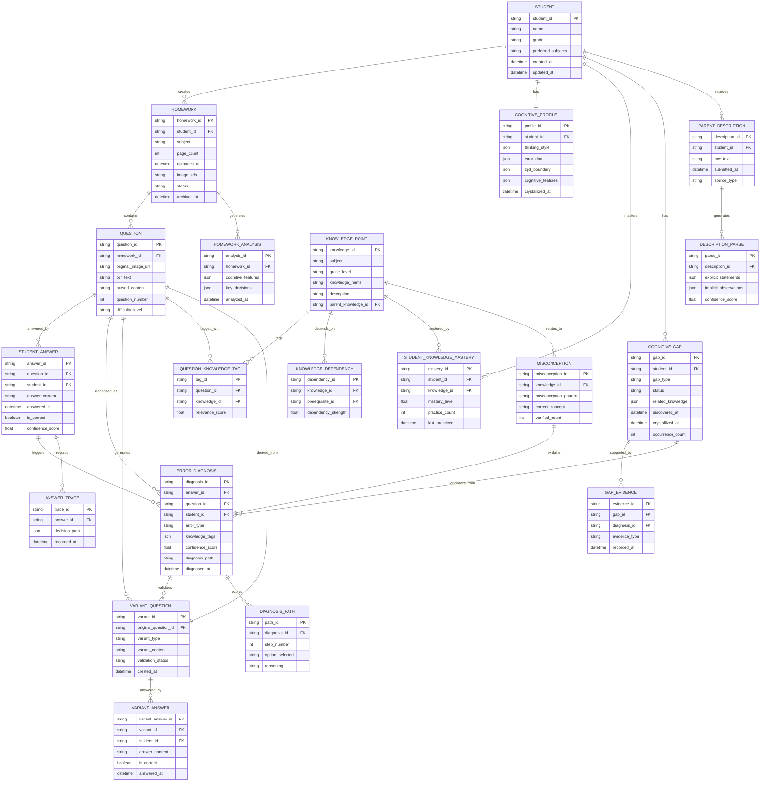
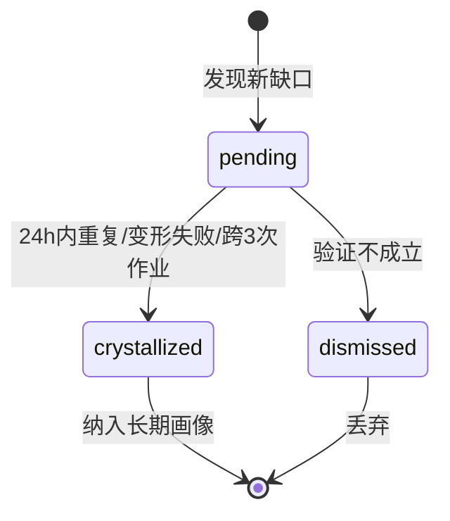
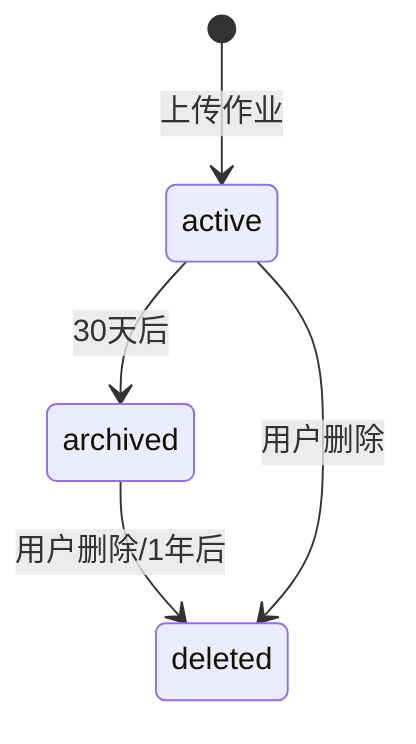
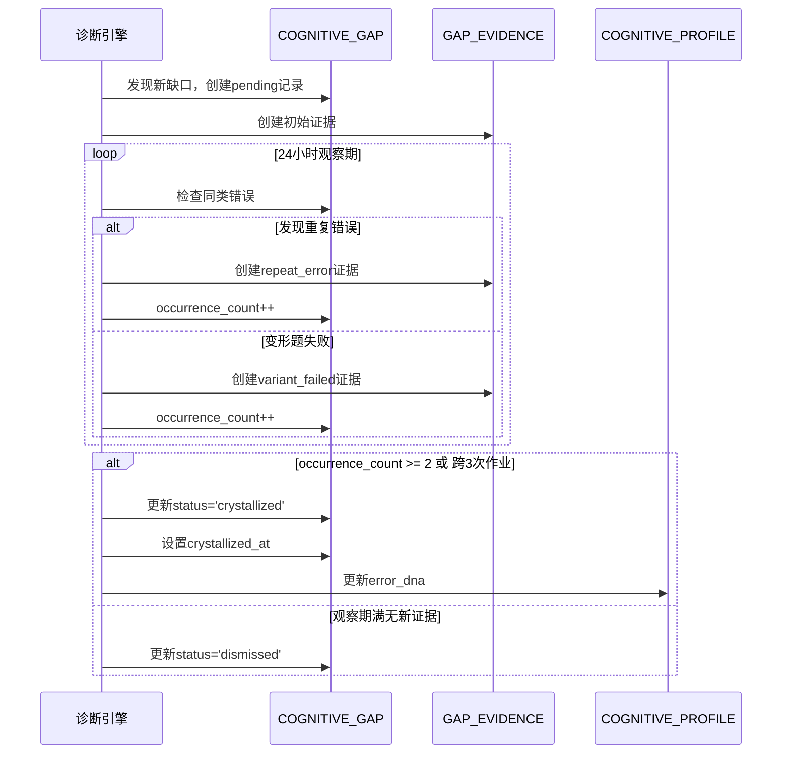

# AI助教系统 - 数据模型设计文档

> 版本: v1.0  
> 更新日期: 2024年  
> 设计目标: 支持OpenHarness风格的记忆系统架构，确保数据可追溯性和一致性

---

## 一、实体关系图（ER图）



---

## 二、实体详细定义

### 2.1 学生相关实体

#### 2.1.1 STUDENT（学生基本信息）

| 字段名 | 类型 | 约束 | 默认值 | 说明 |
|--------|------|------|--------|------|
| student_id | VARCHAR(32) | PRIMARY KEY | - | 学生唯一标识 |
| name | VARCHAR(64) | NOT NULL | - | 学生姓名 🔒敏感数据 |
| grade | VARCHAR(16) | NOT NULL | - | 年级（如：七年级） |
| preferred_subjects | JSON | - | '[]' | 学科偏好列表 |
| created_at | DATETIME | NOT NULL | CURRENT_TIMESTAMP | 创建时间 |
| updated_at | DATETIME | NOT NULL | CURRENT_TIMESTAMP | 更新时间 |

**索引设计：**
- `idx_student_grade`: (grade) - 按年级查询学生列表
- `idx_student_updated`: (updated_at) - 同步数据时使用

---

#### 2.1.2 COGNITIVE_PROFILE（学生认知画像）

| 字段名 | 类型 | 约束 | 默认值 | 说明 |
|--------|------|------|--------|------|
| profile_id | VARCHAR(32) | PRIMARY KEY | - | 画像唯一标识 |
| student_id | VARCHAR(32) | NOT NULL, UNIQUE, FK | - | 关联学生 |
| thinking_style | JSON | - | '{}' | 思维风格特征 |
| error_dna | JSON | - | '{}' | 错误DNA模式 |
| zpd_boundary | JSON | - | '{}' | 最近发展区边界 |
| cognitive_features | JSON | - | '{}' | 认知特征向量（压缩后） |
| crystallized_at | DATETIME | - | NULL | 固化时间 |
| created_at | DATETIME | NOT NULL | CURRENT_TIMESTAMP | 创建时间 |
| updated_at | DATETIME | NOT NULL | CURRENT_TIMESTAMP | 更新时间 |

**索引设计：**
- `idx_profile_student`: (student_id) - 快速查询学生画像
- `idx_profile_crystallized`: (crystallized_at) - 查询已固化画像

---

### 2.2 作业相关实体

#### 2.2.1 HOMEWORK（作业记录）

| 字段名 | 类型 | 约束 | 默认值 | 说明 |
|--------|------|------|--------|------|
| homework_id | VARCHAR(32) | PRIMARY KEY | - | 作业唯一标识 |
| student_id | VARCHAR(32) | NOT NULL, FK | - | 关联学生 |
| subject | VARCHAR(32) | NOT NULL | - | 学科 |
| page_count | INTEGER | NOT NULL, CHECK > 0 | 1 | 页数 |
| uploaded_at | DATETIME | NOT NULL | CURRENT_TIMESTAMP | 上传时间 |
| image_urls | JSON | NOT NULL | - | 原图URL列表 |
| status | VARCHAR(16) | NOT NULL | 'active' | 状态(active/archived/deleted) |
| archived_at | DATETIME | - | NULL | 归档时间 |
| created_at | DATETIME | NOT NULL | CURRENT_TIMESTAMP | 创建时间 |

**索引设计：**
- `idx_homework_student`: (student_id, uploaded_at DESC) - 查询学生作业历史
- `idx_homework_status`: (status, archived_at) - 归档任务查询
- `idx_homework_uploaded`: (uploaded_at) - 数据清理任务

---

#### 2.2.2 QUESTION（题目信息）

| 字段名 | 类型 | 约束 | 默认值 | 说明 |
|--------|------|------|--------|------|
| question_id | VARCHAR(32) | PRIMARY KEY | - | 题目唯一标识 |
| homework_id | VARCHAR(32) | NOT NULL, FK | - | 关联作业 |
| original_image_url | VARCHAR(512) | - | NULL | 原题图片URL |
| ocr_text | TEXT | - | NULL | OCR识别文本 |
| parsed_content | JSON | - | NULL | 结构化解析内容 |
| question_number | INTEGER | NOT NULL | 1 | 题号 |
| difficulty_level | VARCHAR(16) | - | NULL | 难度等级 |
| created_at | DATETIME | NOT NULL | CURRENT_TIMESTAMP | 创建时间 |

**索引设计：**
- `idx_question_homework`: (homework_id, question_number) - 查询作业内题目
- `idx_question_ocr`: 全文索引(ocr_text) - 题目内容搜索

---

#### 2.2.3 HOMEWORK_ANALYSIS（作业分析结果）

| 字段名 | 类型 | 约束 | 默认值 | 说明 |
|--------|------|------|--------|------|
| analysis_id | VARCHAR(32) | PRIMARY KEY | - | 分析唯一标识 |
| homework_id | VARCHAR(32) | NOT NULL, UNIQUE, FK | - | 关联作业 |
| cognitive_features | JSON | - | '{}' | 提取的认知特征 |
| key_decisions | JSON | - | '[]' | 关键决策节点 |
| analyzed_at | DATETIME | NOT NULL | CURRENT_TIMESTAMP | 分析时间 |

**索引设计：**
- `idx_analysis_homework`: (homework_id) - 快速查询作业分析

---

### 2.3 答题与诊断实体

#### 2.3.1 STUDENT_ANSWER（学生答案）

| 字段名 | 类型 | 约束 | 默认值 | 说明 |
|--------|------|------|--------|------|
| answer_id | VARCHAR(32) | PRIMARY KEY | - | 答案唯一标识 |
| question_id | VARCHAR(32) | NOT NULL, FK | - | 关联题目 |
| student_id | VARCHAR(32) | NOT NULL, FK | - | 关联学生 |
| answer_content | TEXT | NOT NULL | - | 答案内容 |
| answered_at | DATETIME | NOT NULL | CURRENT_TIMESTAMP | 答题时间 |
| is_correct | BOOLEAN | - | NULL | 是否正确 |
| confidence_score | FLOAT | CHECK 0-1 | NULL | 置信度 |
| created_at | DATETIME | NOT NULL | CURRENT_TIMESTAMP | 创建时间 |

**索引设计：**
- `idx_answer_student`: (student_id, answered_at DESC) - 查询学生答题历史
- `idx_answer_question`: (question_id) - 查询题目答题情况
- `idx_answer_correct`: (student_id, is_correct, answered_at) - 统计正确率

---

#### 2.3.2 ANSWER_TRACE（答题决策路径）

| 字段名 | 类型 | 约束 | 默认值 | 说明 |
|--------|------|------|--------|------|
| trace_id | VARCHAR(32) | PRIMARY KEY | - | 路径唯一标识 |
| answer_id | VARCHAR(32) | NOT NULL, FK | - | 关联答案 |
| decision_path | JSON | NOT NULL | - | 决策路径详情 |
| recorded_at | DATETIME | NOT NULL | CURRENT_TIMESTAMP | 记录时间 |

**索引设计：**
- `idx_trace_answer`: (answer_id) - 查询答案路径

---

#### 2.3.3 ERROR_DIAGNOSIS（错题诊断）

| 字段名 | 类型 | 约束 | 默认值 | 说明 |
|--------|------|------|--------|------|
| diagnosis_id | VARCHAR(32) | PRIMARY KEY | - | 诊断唯一标识 |
| answer_id | VARCHAR(32) | NOT NULL, FK | - | 关联答案 |
| question_id | VARCHAR(32) | NOT NULL, FK | - | 关联题目 |
| student_id | VARCHAR(32) | NOT NULL, FK | - | 关联学生 |
| error_type | VARCHAR(32) | NOT NULL | - | 错因类型 |
| knowledge_tags | JSON | NOT NULL | '[]' | 考点标签(≤3条) |
| confidence_score | FLOAT | NOT NULL, CHECK 0-1 | 0.5 | 诊断置信度 |
| diagnosis_path | TEXT | - | NULL | 诊断选项路径摘要 |
| diagnosed_at | DATETIME | NOT NULL | CURRENT_TIMESTAMP | 诊断时间 |
| created_at | DATETIME | NOT NULL | CURRENT_TIMESTAMP | 创建时间 |

**索引设计：**
- `idx_diagnosis_student`: (student_id, diagnosed_at DESC) - 查询学生诊断历史
- `idx_diagnosis_error_type`: (student_id, error_type, diagnosed_at) - 统计错因类型
- `idx_diagnosis_confidence`: (confidence_score) - 筛选高/低置信度诊断

---

#### 2.3.4 DIAGNOSIS_PATH（诊断选项路径详情）

| 字段名 | 类型 | 约束 | 默认值 | 说明 |
|--------|------|------|--------|------|
| path_id | VARCHAR(32) | PRIMARY KEY | - | 路径唯一标识 |
| diagnosis_id | VARCHAR(32) | NOT NULL, FK | - | 关联诊断 |
| step_number | INTEGER | NOT NULL, CHECK > 0 | 1 | 步骤序号 |
| option_selected | VARCHAR(64) | NOT NULL | - | 选择的选项 |
| reasoning | TEXT | - | NULL | 选择理由 |

**索引设计：**
- `idx_path_diagnosis`: (diagnosis_id, step_number) - 查询诊断路径步骤

---

### 2.4 变形题实体

#### 2.4.1 VARIANT_QUESTION（变形题）

| 字段名 | 类型 | 约束 | 默认值 | 说明 |
|--------|------|------|--------|------|
| variant_id | VARCHAR(32) | PRIMARY KEY | - | 变形题唯一标识 |
| original_question_id | VARCHAR(32) | NOT NULL, FK | - | 原题ID |
| variant_type | VARCHAR(32) | NOT NULL | - | 变形类型 |
| variant_content | TEXT | NOT NULL | - | 变形题内容 |
| validation_status | VARCHAR(16) | NOT NULL | 'pending' | 验证状态 |
| created_at | DATETIME | NOT NULL | CURRENT_TIMESTAMP | 创建时间 |

**索引设计：**
- `idx_variant_original`: (original_question_id) - 查询原题的变形题
- `idx_variant_status`: (validation_status, created_at) - 查询待验证变形题

---

#### 2.4.2 VARIANT_ANSWER（变形题答题记录）

| 字段名 | 类型 | 约束 | 默认值 | 说明 |
|--------|------|------|--------|------|
| variant_answer_id | VARCHAR(32) | PRIMARY KEY | - | 答题唯一标识 |
| variant_id | VARCHAR(32) | NOT NULL, FK | - | 关联变形题 |
| student_id | VARCHAR(32) | NOT NULL, FK | - | 关联学生 |
| answer_content | TEXT | NOT NULL | - | 答案内容 |
| is_correct | BOOLEAN | NOT NULL | false | 是否正确 |
| answered_at | DATETIME | NOT NULL | CURRENT_TIMESTAMP | 答题时间 |

**索引设计：**
- `idx_variant_answer_student`: (student_id, variant_id) - 查询学生变形题答题
- `idx_variant_answer_result`: (variant_id, is_correct) - 统计变形题正确率

---

### 2.5 知识图谱实体

#### 2.5.1 KNOWLEDGE_POINT（知识点）

| 字段名 | 类型 | 约束 | 默认值 | 说明 |
|--------|------|------|--------|------|
| knowledge_id | VARCHAR(32) | PRIMARY KEY | - | 知识点唯一标识 |
| subject | VARCHAR(32) | NOT NULL | - | 所属学科 |
| grade_level | VARCHAR(16) | NOT NULL | - | 适用年级 |
| knowledge_name | VARCHAR(128) | NOT NULL | - | 知识点名称 |
| description | TEXT | - | NULL | 知识点描述 |
| parent_knowledge_id | VARCHAR(32) | FK | NULL | 父知识点ID |
| created_at | DATETIME | NOT NULL | CURRENT_TIMESTAMP | 创建时间 |

**索引设计：**
- `idx_knowledge_subject_grade`: (subject, grade_level) - 按学科年级查询
- `idx_knowledge_parent`: (parent_knowledge_id) - 查询子知识点

---

#### 2.5.2 KNOWLEDGE_DEPENDENCY（知识依赖关系）

| 字段名 | 类型 | 约束 | 默认值 | 说明 |
|--------|------|------|--------|------|
| dependency_id | VARCHAR(32) | PRIMARY KEY | - | 依赖唯一标识 |
| knowledge_id | VARCHAR(32) | NOT NULL, FK | - | 知识点ID |
| prerequisite_id | VARCHAR(32) | NOT NULL, FK | - | 前置知识点ID |
| dependency_strength | FLOAT | NOT NULL, CHECK 0-1 | 0.5 | 依赖强度 |
| created_at | DATETIME | NOT NULL | CURRENT_TIMESTAMP | 创建时间 |

**约束：**
- `CHECK knowledge_id != prerequisite_id` - 禁止自依赖

**索引设计：**
- `idx_dependency_knowledge`: (knowledge_id) - 查询知识点的前置依赖
- `idx_dependency_prereq`: (prerequisite_id) - 查询依赖某知识点的知识点
- `UNIQUE(knowledge_id, prerequisite_id)` - 防止重复依赖

---

#### 2.5.3 STUDENT_KNOWLEDGE_MASTERY（学生知识掌握度）

| 字段名 | 类型 | 约束 | 默认值 | 说明 |
|--------|------|------|--------|------|
| mastery_id | VARCHAR(32) | PRIMARY KEY | - | 掌握度唯一标识 |
| student_id | VARCHAR(32) | NOT NULL, FK | - | 关联学生 |
| knowledge_id | VARCHAR(32) | NOT NULL, FK | - | 关联知识点 |
| mastery_level | FLOAT | NOT NULL, CHECK 0-1 | 0 | 掌握度(0-1) |
| practice_count | INTEGER | NOT NULL, CHECK >= 0 | 0 | 练习次数 |
| last_practiced | DATETIME | - | NULL | 最后练习时间 |
| updated_at | DATETIME | NOT NULL | CURRENT_TIMESTAMP | 更新时间 |

**索引设计：**
- `UNIQUE(student_id, knowledge_id)` - 每个学生每个知识点一条记录
- `idx_mastery_student`: (student_id, mastery_level) - 查询学生薄弱知识点
- `idx_mastery_level`: (mastery_level, practice_count) - 筛选需加强知识点

---

#### 2.5.4 QUESTION_KNOWLEDGE_TAG（题目知识点标签）

| 字段名 | 类型 | 约束 | 默认值 | 说明 |
|--------|------|------|--------|------|
| tag_id | VARCHAR(32) | PRIMARY KEY | - | 标签唯一标识 |
| question_id | VARCHAR(32) | NOT NULL, FK | - | 关联题目 |
| knowledge_id | VARCHAR(32) | NOT NULL, FK | - | 关联知识点 |
| relevance_score | FLOAT | NOT NULL, CHECK 0-1 | 1.0 | 相关度分数 |

**索引设计：**
- `UNIQUE(question_id, knowledge_id)` - 防止重复标签
- `idx_tag_knowledge`: (knowledge_id) - 查询知识点的相关题目

---

#### 2.5.5 MISCONCEPTION（概念误解）

| 字段名 | 类型 | 约束 | 默认值 | 说明 |
|--------|------|------|--------|------|
| misconception_id | VARCHAR(32) | PRIMARY KEY | - | 误解唯一标识 |
| knowledge_id | VARCHAR(32) | NOT NULL, FK | - | 关联知识点 |
| misconception_pattern | TEXT | NOT NULL | - | 误解模式描述 |
| correct_concept | TEXT | NOT NULL | - | 正确概念描述 |
| verified_count | INTEGER | NOT NULL, CHECK >= 0 | 0 | 验证次数 |
| created_at | DATETIME | NOT NULL | CURRENT_TIMESTAMP | 创建时间 |

**索引设计：**
- `idx_misconception_knowledge`: (knowledge_id) - 查询知识点的常见误解

---

### 2.6 认知缺口实体

#### 2.6.1 COGNITIVE_GAP（认知缺口）

| 字段名 | 类型 | 约束 | 默认值 | 说明 |
|--------|------|------|--------|------|
| gap_id | VARCHAR(32) | PRIMARY KEY | - | 缺口唯一标识 |
| student_id | VARCHAR(32) | NOT NULL, FK | - | 关联学生 |
| gap_type | VARCHAR(32) | NOT NULL | - | 缺口类型 |
| status | VARCHAR(16) | NOT NULL | 'pending' | 状态(pending/crystallized/dismissed) |
| related_knowledge | JSON | NOT NULL | '[]' | 相关知识点 |
| discovered_at | DATETIME | NOT NULL | CURRENT_TIMESTAMP | 发现时间 |
| crystallized_at | DATETIME | - | NULL | 固化时间 |
| occurrence_count | INTEGER | NOT NULL, CHECK >= 1 | 1 | 出现次数 |
| updated_at | DATETIME | NOT NULL | CURRENT_TIMESTAMP | 更新时间 |

**索引设计：**
- `idx_gap_student`: (student_id, status, discovered_at) - 查询学生认知缺口
- `idx_gap_status`: (status, discovered_at) - 24小时结晶任务查询
- `idx_gap_crystallized`: (crystallized_at) - 查询已固化缺口

---

#### 2.6.2 GAP_EVIDENCE（认知缺口证据）

| 字段名 | 类型 | 约束 | 默认值 | 说明 |
|--------|------|------|--------|------|
| evidence_id | VARCHAR(32) | PRIMARY KEY | - | 证据唯一标识 |
| gap_id | VARCHAR(32) | NOT NULL, FK | - | 关联认知缺口 |
| diagnosis_id | VARCHAR(32) | NOT NULL, FK | - | 关联诊断 |
| evidence_type | VARCHAR(32) | NOT NULL | - | 证据类型 |
| recorded_at | DATETIME | NOT NULL | CURRENT_TIMESTAMP | 记录时间 |

**索引设计：**
- `idx_evidence_gap`: (gap_id, recorded_at) - 查询缺口证据链
- `idx_evidence_diagnosis`: (diagnosis_id) - 查询诊断关联的缺口

---

### 2.7 家长描述实体

#### 2.7.1 PARENT_DESCRIPTION（家长描述）

| 字段名 | 类型 | 约束 | 默认值 | 说明 |
|--------|------|------|--------|------|
| description_id | VARCHAR(32) | PRIMARY KEY | - | 描述唯一标识 |
| student_id | VARCHAR(32) | NOT NULL, FK | - | 关联学生 |
| raw_text | TEXT | NOT NULL | - | 原始描述文本 |
| submitted_at | DATETIME | NOT NULL | CURRENT_TIMESTAMP | 提交时间 |
| source_type | VARCHAR(32) | NOT NULL | 'text' | 来源类型 |
| created_at | DATETIME | NOT NULL | CURRENT_TIMESTAMP | 创建时间 |

**索引设计：**
- `idx_description_student`: (student_id, submitted_at DESC) - 查询学生家长描述

---

#### 2.7.2 DESCRIPTION_PARSE（描述解析结果）

| 字段名 | 类型 | 约束 | 默认值 | 说明 |
|--------|------|------|--------|------|
| parse_id | VARCHAR(32) | PRIMARY KEY | - | 解析唯一标识 |
| description_id | VARCHAR(32) | NOT NULL, UNIQUE, FK | - | 关联描述 |
| explicit_statements | JSON | NOT NULL | '[]' | 显性声明 |
| implicit_observations | JSON | NOT NULL | '[]' | 隐性观察 |
| confidence_score | FLOAT | NOT NULL, CHECK 0-1 | 0.5 | 解析置信度 |
| parsed_at | DATETIME | NOT NULL | CURRENT_TIMESTAMP | 解析时间 |

**索引设计：**
- `idx_parse_description`: (description_id) - 快速查询解析结果
- `idx_parse_confidence`: (confidence_score) - 筛选高/低置信度解析

---

## 三、数据字典

### 3.1 枚举值定义

#### 3.1.1 错因类型（error_type）

| 枚举值 | 说明 | 处理策略 |
|--------|------|----------|
| `careless` | 粗心错误 | 提醒检查习惯 |
| `method_error` | 方法错误 | 推荐解题方法 |
| `concept_gap` | 概念漏洞 | 推送知识点讲解 |
| `calculation_error` | 计算错误 | 强化计算练习 |
| `reading_error` | 审题错误 | 训练审题技巧 |
| `unknown` | 未知类型 | 人工复核 |

#### 3.1.2 变形类型（variant_type）

| 枚举值 | 说明 | 示例 |
|--------|------|------|
| `numeric_change` | 数值变化 | 3+5=8 → 4+6=10 |
| `inverse_operation` | 逆运算 | 3+5=8 → 8-5=? |
| `context_transfer` | 情境迁移 | 苹果问题 → 橙子问题 |
| `difficulty_adjust` | 难度调整 | 增加/减少步骤 |
| `format_change` | 形式变化 | 填空 → 选择 |

#### 3.1.3 认知缺口状态（gap_status）

| 枚举值 | 说明 | 流转条件 |
|--------|------|----------|
| `pending` | 待验证 | 初始状态，24小时观察期 |
| `crystallized` | 已固化 | 满足结晶条件 |
| `dismissed` | 已排除 | 验证不成立 |

#### 3.1.4 变形题验证状态（validation_status）

| 枚举值 | 说明 |
|--------|------|
| `pending` | 待验证 |
| `validated` | 验证通过 |
| `failed` | 验证失败 |
| `expired` | 已过期 |

#### 3.1.5 作业状态（homework_status）

| 枚举值 | 说明 | 数据保留策略 |
|--------|------|--------------|
| `active` | 活跃 | 完整保留 |
| `archived` | 已归档 | 压缩图片，保留特征 |
| `deleted` | 已删除 | 逻辑删除，保留元数据 |

#### 3.1.6 证据类型（evidence_type）

| 枚举值 | 说明 |
|--------|------|
| `initial_diagnosis` | 初始诊断 |
| `repeat_error` | 重复错误 |
| `variant_failed` | 变形题失败 |
| `cross_homework` | 跨作业共现 |

### 3.2 状态流转定义

#### 3.2.1 认知缺口状态流转图



**流转规则：**

| 源状态 | 目标状态 | 触发条件 | 业务规则 |
|--------|----------|----------|----------|
| pending | crystallized | 24小时内再次出现同类错误 | occurrence_count >= 2 |
| pending | crystallized | 变形题验证失败 | variant_answer.is_correct = false |
| pending | crystallized | 跨3次作业共现 | 关联3个不同homework_id |
| pending | dismissed | 观察期满且无新证据 | discovered_at + 24h < NOW() |

#### 3.2.2 作业状态流转图



---

## 四、数据生命周期设计

### 4.1 数据创建策略

| 实体 | 创建时机 | 创建来源 |
|------|----------|----------|
| STUDENT | 用户注册 | 用户输入 |
| COGNITIVE_PROFILE | 学生创建后 | 系统初始化（空JSON） |
| HOMEWORK | 作业上传 | 用户上传 + AI解析 |
| QUESTION | 作业解析完成 | AI OCR + 结构化 |
| STUDENT_ANSWER | 学生提交答案 | 用户输入 |
| ERROR_DIAGNOSIS | 答案判定错误 | AI诊断引擎 |
| VARIANT_QUESTION | 诊断完成后 | AI变形题生成器 |
| COGNITIVE_GAP | 诊断发现新概念漏洞 | AI分析引擎 |

### 4.2 数据更新策略

| 实体 | 更新时机 | 更新规则 |
|------|----------|----------|
| COGNITIVE_PROFILE | 每次作业分析后 | 增量更新thinking_style/error_dna |
| STUDENT_KNOWLEDGE_MASTERY | 答题后 | 根据正确率调整mastery_level |
| COGNITIVE_GAP | 发现新证据时 | occurrence_count++，检查结晶条件 |
| HOMEWORK | 归档任务执行时 | status → 'archived' |

### 4.3 24小时结晶机制数据流转



**结晶条件判定逻辑：**

```sql
-- 检查是否满足结晶条件
SELECT gap_id
FROM COGNITIVE_GAP g
WHERE status = 'pending'
  AND discovered_at <= datetime('now', '-24 hours')
  AND (
      occurrence_count >= 2
      OR (
          SELECT COUNT(DISTINCT h.homework_id)
          FROM GAP_EVIDENCE ge
          JOIN ERROR_DIAGNOSIS ed ON ge.diagnosis_id = ed.diagnosis_id
          JOIN STUDENT_ANSWER sa ON ed.answer_id = sa.answer_id
          JOIN QUESTION q ON sa.question_id = q.question_id
          JOIN HOMEWORK h ON q.homework_id = h.homework_id
          WHERE ge.gap_id = g.gap_id
      ) >= 3
  )
```

### 4.4 数据压缩策略（Auto-compact）

| 数据类型 | 保留期限 | 压缩策略 | 压缩后存储 |
|----------|----------|----------|------------|
| 原始作业图片 | 30天 | 提取认知特征向量 | COGNITIVE_PROFILE.cognitive_features |
| 答题过程数据 | 30天 | 保留关键决策节点 | ANSWER_TRACE.decision_path |
| 诊断中间结果 | 7天 | 保留最终诊断 | ERROR_DIAGNOSIS |
| 变形题过期记录 | 90天 | 删除详细内容，保留元数据 | VARIANT_QUESTION(status='expired') |

**压缩任务调度：**

```sql
-- 30天前作业图片压缩
UPDATE HOMEWORK
SET status = 'archived',
    archived_at = CURRENT_TIMESTAMP
WHERE uploaded_at <= datetime('now', '-30 days')
  AND status = 'active';

-- 清理过期原始图片（实际删除文件由外部任务处理）
-- 认知特征向量由AI引擎异步生成并更新到COGNITIVE_PROFILE
```

### 4.5 数据归档策略

| 实体 | 归档条件 | 归档操作 |
|------|----------|----------|
| HOMEWORK | 上传30天后 | status → 'archived'，触发图片压缩 |
| ANSWER_TRACE | 相关作业归档后 | 保留决策路径，删除详细过程 |
| COGNITIVE_GAP | status='dismissed'且30天后 | 软删除，保留统计用途 |
| VARIANT_QUESTION | 创建90天后未使用 | status → 'expired' |

### 4.6 数据删除策略

| 实体 | 删除条件 | 删除方式 |
|------|----------|----------|
| HOMEWORK | 用户主动删除/归档1年后 | 逻辑删除 + 异步物理删除图片 |
| STUDENT | 账号注销 | 逻辑删除，保留匿名化数据用于研究 |
| COGNITIVE_GAP | dismissed 30天后 | 物理删除 |

---

## 五、SQLite Schema设计

### 5.1 完整DDL语句

```sql
-- ============================================
-- AI助教系统 - SQLite数据库Schema
-- 版本: v1.0
-- ============================================

-- 启用外键约束
PRAGMA foreign_keys = ON;

-- ============================================
-- 1. 学生相关表
-- ============================================

CREATE TABLE student (
    student_id VARCHAR(32) PRIMARY KEY,
    name VARCHAR(64) NOT NULL,  -- 敏感数据
    grade VARCHAR(16) NOT NULL,
    preferred_subjects JSON DEFAULT '[]',
    created_at DATETIME NOT NULL DEFAULT CURRENT_TIMESTAMP,
    updated_at DATETIME NOT NULL DEFAULT CURRENT_TIMESTAMP
);

CREATE INDEX idx_student_grade ON student(grade);
CREATE INDEX idx_student_updated ON student(updated_at);

CREATE TABLE cognitive_profile (
    profile_id VARCHAR(32) PRIMARY KEY,
    student_id VARCHAR(32) NOT NULL UNIQUE,
    thinking_style JSON DEFAULT '{}',
    error_dna JSON DEFAULT '{}',
    zpd_boundary JSON DEFAULT '{}',
    cognitive_features JSON DEFAULT '{}',
    crystallized_at DATETIME,
    created_at DATETIME NOT NULL DEFAULT CURRENT_TIMESTAMP,
    updated_at DATETIME NOT NULL DEFAULT CURRENT_TIMESTAMP,
    FOREIGN KEY (student_id) REFERENCES student(student_id) ON DELETE CASCADE
);

CREATE INDEX idx_profile_student ON cognitive_profile(student_id);
CREATE INDEX idx_profile_crystallized ON cognitive_profile(crystallized_at);

-- ============================================
-- 2. 作业相关表
-- ============================================

CREATE TABLE homework (
    homework_id VARCHAR(32) PRIMARY KEY,
    student_id VARCHAR(32) NOT NULL,
    subject VARCHAR(32) NOT NULL,
    page_count INTEGER NOT NULL CHECK (page_count > 0),
    uploaded_at DATETIME NOT NULL DEFAULT CURRENT_TIMESTAMP,
    image_urls JSON NOT NULL,
    status VARCHAR(16) NOT NULL DEFAULT 'active' CHECK (status IN ('active', 'archived', 'deleted')),
    archived_at DATETIME,
    created_at DATETIME NOT NULL DEFAULT CURRENT_TIMESTAMP,
    FOREIGN KEY (student_id) REFERENCES student(student_id) ON DELETE CASCADE
);

CREATE INDEX idx_homework_student ON homework(student_id, uploaded_at DESC);
CREATE INDEX idx_homework_status ON homework(status, archived_at);
CREATE INDEX idx_homework_uploaded ON homework(uploaded_at);

CREATE TABLE question (
    question_id VARCHAR(32) PRIMARY KEY,
    homework_id VARCHAR(32) NOT NULL,
    original_image_url VARCHAR(512),
    ocr_text TEXT,
    parsed_content JSON,
    question_number INTEGER NOT NULL DEFAULT 1,
    difficulty_level VARCHAR(16),
    created_at DATETIME NOT NULL DEFAULT CURRENT_TIMESTAMP,
    FOREIGN KEY (homework_id) REFERENCES homework(homework_id) ON DELETE CASCADE
);

CREATE INDEX idx_question_homework ON question(homework_id, question_number);

-- 全文搜索表（用于OCR文本搜索）
CREATE VIRTUAL TABLE question_fts USING fts5(
    question_id,
    ocr_text,
    content='question',
    content_rowid='rowid'
);

CREATE TABLE homework_analysis (
    analysis_id VARCHAR(32) PRIMARY KEY,
    homework_id VARCHAR(32) NOT NULL UNIQUE,
    cognitive_features JSON DEFAULT '{}',
    key_decisions JSON DEFAULT '[]',
    analyzed_at DATETIME NOT NULL DEFAULT CURRENT_TIMESTAMP,
    FOREIGN KEY (homework_id) REFERENCES homework(homework_id) ON DELETE CASCADE
);

CREATE INDEX idx_analysis_homework ON homework_analysis(homework_id);

-- ============================================
-- 3. 答题与诊断表
-- ============================================

CREATE TABLE student_answer (
    answer_id VARCHAR(32) PRIMARY KEY,
    question_id VARCHAR(32) NOT NULL,
    student_id VARCHAR(32) NOT NULL,
    answer_content TEXT NOT NULL,
    answered_at DATETIME NOT NULL DEFAULT CURRENT_TIMESTAMP,
    is_correct BOOLEAN,
    confidence_score FLOAT CHECK (confidence_score >= 0 AND confidence_score <= 1),
    created_at DATETIME NOT NULL DEFAULT CURRENT_TIMESTAMP,
    FOREIGN KEY (question_id) REFERENCES question(question_id) ON DELETE CASCADE,
    FOREIGN KEY (student_id) REFERENCES student(student_id) ON DELETE CASCADE
);

CREATE INDEX idx_answer_student ON student_answer(student_id, answered_at DESC);
CREATE INDEX idx_answer_question ON student_answer(question_id);
CREATE INDEX idx_answer_correct ON student_answer(student_id, is_correct, answered_at);

CREATE TABLE answer_trace (
    trace_id VARCHAR(32) PRIMARY KEY,
    answer_id VARCHAR(32) NOT NULL,
    decision_path JSON NOT NULL,
    recorded_at DATETIME NOT NULL DEFAULT CURRENT_TIMESTAMP,
    FOREIGN KEY (answer_id) REFERENCES student_answer(answer_id) ON DELETE CASCADE
);

CREATE INDEX idx_trace_answer ON answer_trace(answer_id);

CREATE TABLE error_diagnosis (
    diagnosis_id VARCHAR(32) PRIMARY KEY,
    answer_id VARCHAR(32) NOT NULL,
    question_id VARCHAR(32) NOT NULL,
    student_id VARCHAR(32) NOT NULL,
    error_type VARCHAR(32) NOT NULL CHECK (error_type IN ('careless', 'method_error', 'concept_gap', 'calculation_error', 'reading_error', 'unknown')),
    knowledge_tags JSON NOT NULL DEFAULT '[]',
    confidence_score FLOAT NOT NULL DEFAULT 0.5 CHECK (confidence_score >= 0 AND confidence_score <= 1),
    diagnosis_path TEXT,
    diagnosed_at DATETIME NOT NULL DEFAULT CURRENT_TIMESTAMP,
    created_at DATETIME NOT NULL DEFAULT CURRENT_TIMESTAMP,
    FOREIGN KEY (answer_id) REFERENCES student_answer(answer_id) ON DELETE CASCADE,
    FOREIGN KEY (question_id) REFERENCES question(question_id) ON DELETE CASCADE,
    FOREIGN KEY (student_id) REFERENCES student(student_id) ON DELETE CASCADE
);

CREATE INDEX idx_diagnosis_student ON error_diagnosis(student_id, diagnosed_at DESC);
CREATE INDEX idx_diagnosis_error_type ON error_diagnosis(student_id, error_type, diagnosed_at);
CREATE INDEX idx_diagnosis_confidence ON error_diagnosis(confidence_score);

CREATE TABLE diagnosis_path (
    path_id VARCHAR(32) PRIMARY KEY,
    diagnosis_id VARCHAR(32) NOT NULL,
    step_number INTEGER NOT NULL CHECK (step_number > 0),
    option_selected VARCHAR(64) NOT NULL,
    reasoning TEXT,
    FOREIGN KEY (diagnosis_id) REFERENCES error_diagnosis(diagnosis_id) ON DELETE CASCADE
);

CREATE INDEX idx_path_diagnosis ON diagnosis_path(diagnosis_id, step_number);

-- ============================================
-- 4. 变形题表
-- ============================================

CREATE TABLE variant_question (
    variant_id VARCHAR(32) PRIMARY KEY,
    original_question_id VARCHAR(32) NOT NULL,
    variant_type VARCHAR(32) NOT NULL CHECK (variant_type IN ('numeric_change', 'inverse_operation', 'context_transfer', 'difficulty_adjust', 'format_change')),
    variant_content TEXT NOT NULL,
    validation_status VARCHAR(16) NOT NULL DEFAULT 'pending' CHECK (validation_status IN ('pending', 'validated', 'failed', 'expired')),
    created_at DATETIME NOT NULL DEFAULT CURRENT_TIMESTAMP,
    FOREIGN KEY (original_question_id) REFERENCES question(question_id) ON DELETE CASCADE
);

CREATE INDEX idx_variant_original ON variant_question(original_question_id);
CREATE INDEX idx_variant_status ON variant_question(validation_status, created_at);

CREATE TABLE variant_answer (
    variant_answer_id VARCHAR(32) PRIMARY KEY,
    variant_id VARCHAR(32) NOT NULL,
    student_id VARCHAR(32) NOT NULL,
    answer_content TEXT NOT NULL,
    is_correct BOOLEAN NOT NULL DEFAULT 0,
    answered_at DATETIME NOT NULL DEFAULT CURRENT_TIMESTAMP,
    FOREIGN KEY (variant_id) REFERENCES variant_question(variant_id) ON DELETE CASCADE,
    FOREIGN KEY (student_id) REFERENCES student(student_id) ON DELETE CASCADE
);

CREATE INDEX idx_variant_answer_student ON variant_answer(student_id, variant_id);
CREATE INDEX idx_variant_answer_result ON variant_answer(variant_id, is_correct);

-- ============================================
-- 5. 知识图谱表
-- ============================================

CREATE TABLE knowledge_point (
    knowledge_id VARCHAR(32) PRIMARY KEY,
    subject VARCHAR(32) NOT NULL,
    grade_level VARCHAR(16) NOT NULL,
    knowledge_name VARCHAR(128) NOT NULL,
    description TEXT,
    parent_knowledge_id VARCHAR(32),
    created_at DATETIME NOT NULL DEFAULT CURRENT_TIMESTAMP,
    FOREIGN KEY (parent_knowledge_id) REFERENCES knowledge_point(knowledge_id) ON DELETE SET NULL
);

CREATE INDEX idx_knowledge_subject_grade ON knowledge_point(subject, grade_level);
CREATE INDEX idx_knowledge_parent ON knowledge_point(parent_knowledge_id);

CREATE TABLE knowledge_dependency (
    dependency_id VARCHAR(32) PRIMARY KEY,
    knowledge_id VARCHAR(32) NOT NULL,
    prerequisite_id VARCHAR(32) NOT NULL,
    dependency_strength FLOAT NOT NULL DEFAULT 0.5 CHECK (dependency_strength >= 0 AND dependency_strength <= 1),
    created_at DATETIME NOT NULL DEFAULT CURRENT_TIMESTAMP,
    FOREIGN KEY (knowledge_id) REFERENCES knowledge_point(knowledge_id) ON DELETE CASCADE,
    FOREIGN KEY (prerequisite_id) REFERENCES knowledge_point(knowledge_id) ON DELETE CASCADE,
    CHECK (knowledge_id != prerequisite_id),
    UNIQUE(knowledge_id, prerequisite_id)
);

CREATE INDEX idx_dependency_knowledge ON knowledge_dependency(knowledge_id);
CREATE INDEX idx_dependency_prereq ON knowledge_dependency(prerequisite_id);

CREATE TABLE student_knowledge_mastery (
    mastery_id VARCHAR(32) PRIMARY KEY,
    student_id VARCHAR(32) NOT NULL,
    knowledge_id VARCHAR(32) NOT NULL,
    mastery_level FLOAT NOT NULL DEFAULT 0 CHECK (mastery_level >= 0 AND mastery_level <= 1),
    practice_count INTEGER NOT NULL DEFAULT 0 CHECK (practice_count >= 0),
    last_practiced DATETIME,
    updated_at DATETIME NOT NULL DEFAULT CURRENT_TIMESTAMP,
    FOREIGN KEY (student_id) REFERENCES student(student_id) ON DELETE CASCADE,
    FOREIGN KEY (knowledge_id) REFERENCES knowledge_point(knowledge_id) ON DELETE CASCADE,
    UNIQUE(student_id, knowledge_id)
);

CREATE INDEX idx_mastery_student ON student_knowledge_mastery(student_id, mastery_level);
CREATE INDEX idx_mastery_level ON student_knowledge_mastery(mastery_level, practice_count);

CREATE TABLE question_knowledge_tag (
    tag_id VARCHAR(32) PRIMARY KEY,
    question_id VARCHAR(32) NOT NULL,
    knowledge_id VARCHAR(32) NOT NULL,
    relevance_score FLOAT NOT NULL DEFAULT 1.0 CHECK (relevance_score >= 0 AND relevance_score <= 1),
    FOREIGN KEY (question_id) REFERENCES question(question_id) ON DELETE CASCADE,
    FOREIGN KEY (knowledge_id) REFERENCES knowledge_point(knowledge_id) ON DELETE CASCADE,
    UNIQUE(question_id, knowledge_id)
);

CREATE INDEX idx_tag_knowledge ON question_knowledge_tag(knowledge_id);

CREATE TABLE misconception (
    misconception_id VARCHAR(32) PRIMARY KEY,
    knowledge_id VARCHAR(32) NOT NULL,
    misconception_pattern TEXT NOT NULL,
    correct_concept TEXT NOT NULL,
    verified_count INTEGER NOT NULL DEFAULT 0 CHECK (verified_count >= 0),
    created_at DATETIME NOT NULL DEFAULT CURRENT_TIMESTAMP,
    FOREIGN KEY (knowledge_id) REFERENCES knowledge_point(knowledge_id) ON DELETE CASCADE
);

CREATE INDEX idx_misconception_knowledge ON misconception(knowledge_id);

-- ============================================
-- 6. 认知缺口表
-- ============================================

CREATE TABLE cognitive_gap (
    gap_id VARCHAR(32) PRIMARY KEY,
    student_id VARCHAR(32) NOT NULL,
    gap_type VARCHAR(32) NOT NULL,
    status VARCHAR(16) NOT NULL DEFAULT 'pending' CHECK (status IN ('pending', 'crystallized', 'dismissed')),
    related_knowledge JSON NOT NULL DEFAULT '[]',
    discovered_at DATETIME NOT NULL DEFAULT CURRENT_TIMESTAMP,
    crystallized_at DATETIME,
    occurrence_count INTEGER NOT NULL DEFAULT 1 CHECK (occurrence_count >= 1),
    updated_at DATETIME NOT NULL DEFAULT CURRENT_TIMESTAMP,
    FOREIGN KEY (student_id) REFERENCES student(student_id) ON DELETE CASCADE
);

CREATE INDEX idx_gap_student ON cognitive_gap(student_id, status, discovered_at);
CREATE INDEX idx_gap_status ON cognitive_gap(status, discovered_at);
CREATE INDEX idx_gap_crystallized ON cognitive_gap(crystallized_at);

CREATE TABLE gap_evidence (
    evidence_id VARCHAR(32) PRIMARY KEY,
    gap_id VARCHAR(32) NOT NULL,
    diagnosis_id VARCHAR(32) NOT NULL,
    evidence_type VARCHAR(32) NOT NULL CHECK (evidence_type IN ('initial_diagnosis', 'repeat_error', 'variant_failed', 'cross_homework')),
    recorded_at DATETIME NOT NULL DEFAULT CURRENT_TIMESTAMP,
    FOREIGN KEY (gap_id) REFERENCES cognitive_gap(gap_id) ON DELETE CASCADE,
    FOREIGN KEY (diagnosis_id) REFERENCES error_diagnosis(diagnosis_id) ON DELETE CASCADE
);

CREATE INDEX idx_evidence_gap ON gap_evidence(gap_id, recorded_at);
CREATE INDEX idx_evidence_diagnosis ON gap_evidence(diagnosis_id);

-- ============================================
-- 7. 家长描述表
-- ============================================

CREATE TABLE parent_description (
    description_id VARCHAR(32) PRIMARY KEY,
    student_id VARCHAR(32) NOT NULL,
    raw_text TEXT NOT NULL,
    submitted_at DATETIME NOT NULL DEFAULT CURRENT_TIMESTAMP,
    source_type VARCHAR(32) NOT NULL DEFAULT 'text' CHECK (source_type IN ('text', 'voice', 'video')),
    created_at DATETIME NOT NULL DEFAULT CURRENT_TIMESTAMP,
    FOREIGN KEY (student_id) REFERENCES student(student_id) ON DELETE CASCADE
);

CREATE INDEX idx_description_student ON parent_description(student_id, submitted_at DESC);

CREATE TABLE description_parse (
    parse_id VARCHAR(32) PRIMARY KEY,
    description_id VARCHAR(32) NOT NULL UNIQUE,
    explicit_statements JSON NOT NULL DEFAULT '[]',
    implicit_observations JSON NOT NULL DEFAULT '[]',
    confidence_score FLOAT NOT NULL DEFAULT 0.5 CHECK (confidence_score >= 0 AND confidence_score <= 1),
    parsed_at DATETIME NOT NULL DEFAULT CURRENT_TIMESTAMP,
    FOREIGN KEY (description_id) REFERENCES parent_description(description_id) ON DELETE CASCADE
);

CREATE INDEX idx_parse_description ON description_parse(description_id);
CREATE INDEX idx_parse_confidence ON description_parse(confidence_score);

-- ============================================
-- 8. 触发器
-- ============================================

-- 自动更新updated_at字段的触发器
CREATE TRIGGER trg_student_updated AFTER UPDATE ON student
BEGIN
    UPDATE student SET updated_at = CURRENT_TIMESTAMP WHERE student_id = NEW.student_id;
END;

CREATE TRIGGER trg_cognitive_profile_updated AFTER UPDATE ON cognitive_profile
BEGIN
    UPDATE cognitive_profile SET updated_at = CURRENT_TIMESTAMP WHERE profile_id = NEW.profile_id;
END;

CREATE TRIGGER trg_student_knowledge_mastery_updated AFTER UPDATE ON student_knowledge_mastery
BEGIN
    UPDATE student_knowledge_mastery SET updated_at = CURRENT_TIMESTAMP WHERE mastery_id = NEW.mastery_id;
END;

CREATE TRIGGER trg_cognitive_gap_updated AFTER UPDATE ON cognitive_gap
BEGIN
    UPDATE cognitive_gap SET updated_at = CURRENT_TIMESTAMP WHERE gap_id = NEW.gap_id;
END;

-- 全文搜索同步触发器
CREATE TRIGGER trg_question_fts_insert AFTER INSERT ON question
BEGIN
    INSERT INTO question_fts(question_id, ocr_text) VALUES (NEW.question_id, NEW.ocr_text);
END;

CREATE TRIGGER trg_question_fts_update AFTER UPDATE ON question
BEGIN
    UPDATE question_fts SET ocr_text = NEW.ocr_text WHERE question_id = NEW.question_id;
END;

CREATE TRIGGER trg_question_fts_delete AFTER DELETE ON question
BEGIN
    DELETE FROM question_fts WHERE question_id = OLD.question_id;
END;
```

### 5.2 常用查询示例

```sql
-- 查询学生的认知缺口（含证据数量）
SELECT 
    g.gap_id,
    g.gap_type,
    g.status,
    g.occurrence_count,
    g.discovered_at,
    COUNT(ge.evidence_id) as evidence_count
FROM cognitive_gap g
LEFT JOIN gap_evidence ge ON g.gap_id = ge.gap_id
WHERE g.student_id = ?
GROUP BY g.gap_id
ORDER BY g.discovered_at DESC;

-- 查询学生的薄弱知识点（掌握度<0.5）
SELECT 
    kp.knowledge_name,
    kp.subject,
    skm.mastery_level,
    skm.practice_count,
    skm.last_practiced
FROM student_knowledge_mastery skm
JOIN knowledge_point kp ON skm.knowledge_id = kp.knowledge_id
WHERE skm.student_id = ?
  AND skm.mastery_level < 0.5
ORDER BY skm.mastery_level ASC;

-- 查询需要结晶的认知缺口（24小时观察期满）
SELECT gap_id, student_id, gap_type, occurrence_count
FROM cognitive_gap
WHERE status = 'pending'
  AND discovered_at <= datetime('now', '-24 hours')
  AND occurrence_count >= 2;

-- 查询学生的错题统计（按错因类型分组）
SELECT 
    error_type,
    COUNT(*) as error_count,
    AVG(confidence_score) as avg_confidence
FROM error_diagnosis
WHERE student_id = ?
  AND diagnosed_at >= datetime('now', '-30 days')
GROUP BY error_type
ORDER BY error_count DESC;

-- 查询待归档的作业（30天前上传）
SELECT homework_id, student_id, uploaded_at
FROM homework
WHERE status = 'active'
  AND uploaded_at <= datetime('now', '-30 days');
```

---

## 六、数据一致性保障

### 6.1 外键约束策略

| 父表 | 子表 | 删除策略 | 说明 |
|------|------|----------|------|
| student | cognitive_profile | CASCADE | 学生删除，画像级联删除 |
| student | homework | CASCADE | 学生删除，作业级联删除 |
| homework | question | CASCADE | 作业删除，题目级联删除 |
| question | student_answer | CASCADE | 题目删除，答案级联删除 |
| error_diagnosis | gap_evidence | CASCADE | 诊断删除，证据级联删除 |

### 6.2 事务设计原则

| 业务场景 | 事务包含操作 | 隔离级别 |
|----------|--------------|----------|
| 创建认知缺口 | INSERT gap + INSERT evidence | SERIALIZABLE |
| 更新知识掌握度 | UPDATE mastery + INSERT answer | READ COMMITTED |
| 结晶认知缺口 | UPDATE gap + UPDATE profile | SERIALIZABLE |
| 归档作业 | UPDATE homework + DELETE images | READ COMMITTED |

### 6.3 数据校验规则

```sql
-- 检查认知缺口证据一致性
SELECT g.gap_id
FROM cognitive_gap g
LEFT JOIN gap_evidence ge ON g.gap_id = ge.gap_id
GROUP BY g.gap_id
HAVING COUNT(ge.evidence_id) != g.occurrence_count;

-- 检查知识掌握度范围
SELECT mastery_id
FROM student_knowledge_mastery
WHERE mastery_level < 0 OR mastery_level > 1;

-- 检查循环依赖
WITH RECURSIVE dependency_chain AS (
    SELECT knowledge_id, prerequisite_id, 1 as depth
    FROM knowledge_dependency
    UNION ALL
    SELECT dc.knowledge_id, kd.prerequisite_id, dc.depth + 1
    FROM dependency_chain dc
    JOIN knowledge_dependency kd ON dc.prerequisite_id = kd.knowledge_id
    WHERE dc.depth < 10
)
SELECT knowledge_id
FROM dependency_chain
WHERE knowledge_id = prerequisite_id;
```

---

## 附录：敏感数据清单

| 实体 | 字段 | 敏感级别 | 处理建议 |
|------|------|----------|----------|
| student | name | 高 | 加密存储，访问审计 |
| parent_description | raw_text | 高 | 加密存储，定期清理 |
| homework | image_urls | 中 | 访问控制，定期归档 |
| student_answer | answer_content | 低 | 正常存储 |

---

*文档结束*
