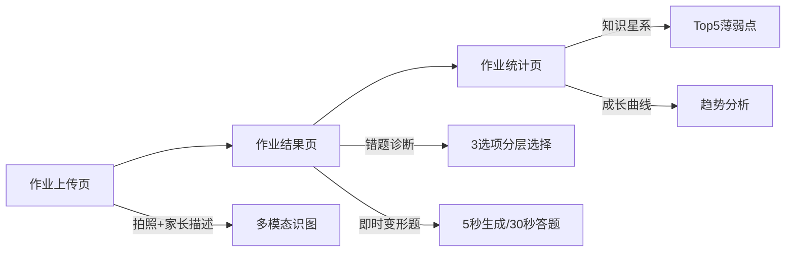
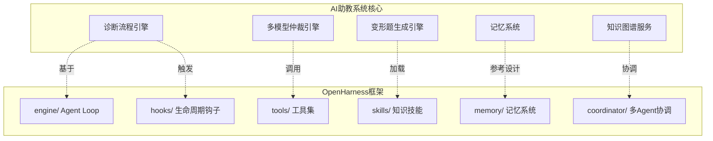
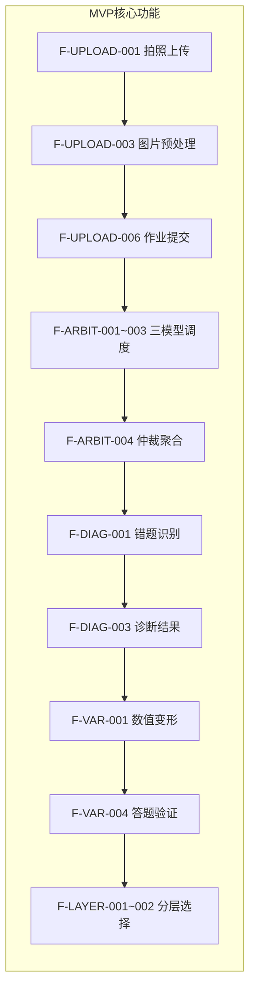
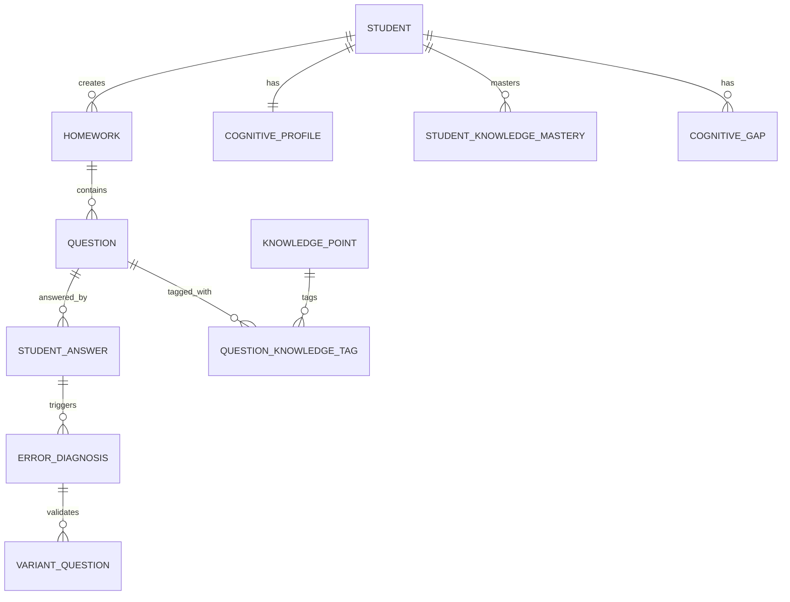

# AI助教系统 - 开发技术文档

> **文档版本**: v1.0  
> **最后更新**: 2024年  
> **文档状态**: 设计完成  
> **关联项目**: OpenHarness架构集成

---

## 文档导航

本文档是AI助教系统的完整开发技术文档，包含以下核心模块：

| 模块 | 文档 | 说明 |
|------|------|------|
| **系统架构** | [01-系统架构设计.md](./01-系统架构设计.md) | 分层架构、模块设计、OpenHarness集成 |
| **功能模块** | [02-功能模块设计.md](./02-功能模块设计.md) | 51个功能点详细设计（含追溯ID） |
| **数据模型** | [03-数据模型设计.md](./03-数据模型设计.md) | ER图、SQLite Schema、数据字典 |
| **API接口** | [04-API接口设计.md](./04-API接口设计.md) | 21个API、OpenAPI规范 |
| **测试策略** | [05-测试策略设计.md](./05-测试策略设计.md) | 100+测试用例、覆盖率目标 |

---

## 1. 项目概述

### 1.1 核心目标

通过AI驱动的作业监控，识别学习问题的**根本原因**（而非仅判对错），推动知识掌握与融会贯通能力。

### 1.2 目标用户

- **主要用户**: 中学生（13-16岁）
- **辅助用户**: 家长（提供观察输入）
- **适用学科**: 数学、物理、化学（理科）

### 1.3 设计理念

| 原则 | 说明 |
|------|------|
| **诊断先于讲解** | 先定位认知断点，再推送解决方案 |
| **少即是多** | 考点描述≤3条，诊断选项≤3个，避免认知过载 |
| **数据驱动** | 1个月冷启动积累，形成个人认知画像 |

---

## 2. 核心功能架构

### 2.1 三页面极简架构



### 2.2 90秒闭环诊断流程

```
作业照片上传 (0s)
    ↓
多模态识图 (Vision API) (5s)
    ↓
题目理解 + 答案提取 + 学科分类 (10s)
    ↓
3模型仲裁 (并行推理) (20s)
    ↓
考点识别(≤3条) + 错因初判
    ↓
即时变形题生成 (AI实时) (5s)
    ↓
验证:粗心?/方法错误?/概念漏洞? (30s)
    ↓
分层选择诊断 (2-3步) (15s)
    ↓
定位具体认知断点
    ↓
动态知识图谱更新
    ↓
推荐下一步行动 (5s)
```

### 2.3 多模型仲裁机制

| 模型角色 | 核心职责 | 输出 | 权重 |
|----------|----------|------|------|
| **模型A** (GPT-4 通用) | 题目解构、考点分类 | 考点标签(≤3条)、难度评估 | 0.4 |
| **模型B** (DeepSeek-Math) | 逻辑推演、步骤验证 | 标准解法、错误步骤定位 | 0.4 |
| **模型C** (Llama-3-70B) | 概念映射、归因交叉验证 | 前置知识缺口、错因类型 | 0.2 |

**仲裁逻辑**:
- **共识≥2/3**: 采用多数结果，置信度"高"
- **全部分歧**: 触发即时变形题测试，置信度"待验证"
- **冲突利用**: 将分歧本身作为诊断选项（训练元认知）

---

## 3. OpenHarness集成设计

### 3.1 架构映射关系



### 3.2 Agent Loop集成

```python
# 基于OpenHarness的Agent Loop模式
class DiagnosisAgentLoop:
    """90秒闭环诊断Agent"""
    
    async def run(self, homework_input):
        messages = [self._create_system_prompt()]
        
        while True:
            # 调用模型流式输出
            response = await self.api.stream(messages, self.tools)
            
            if response.stop_reason != "tool_use":
                break  # 诊断完成
            
            for tool_call in response.tool_uses:
                # 权限检查 → Hook → 执行 → Hook → 结果
                result = await self.harness.execute_tool(tool_call)
                
                # 记录到记忆系统
                await self.memory.record(tool_call, result)
            
            messages.append(tool_results)
            
            # 检查90秒超时
            if self._timeout_exceeded():
                await self._handle_timeout()
                break
```

### 3.3 记忆系统架构（OpenHarness风格）

```
student_memory/
├── profile/                    # 长期认知画像
│   ├── cognitive_model.json     # 思维风格、错误DNA
│   └── zone_of_proximity.json   # 当前ZPD边界
├── episodic/                   # 作业事件流
│   ├── traces/                 # 解题决策路径
│   └── exercises/              # 原题与变形题lineage
├── semantic/                   # 结构化知识
│   ├── misconceptions/         # 已验证的概念误解
│   └── prerequisite_chains/    # 个人化知识依赖
└── meta/                       # 元认知层
    ├── pending_gaps.json       # 待验证缺口（24小时观察期）
    └── crystallized/           # 已固化认知特征（≥30天）
```

---

## 4. 功能模块清单（可追溯）

### 4.1 功能追溯矩阵

| 模块ID | 模块名称 | 功能数量 | 优先级 | 人天估算 | 状态 |
|--------|----------|----------|--------|----------|------|
| F-UPLOAD | 作业上传 | 6 | P0 | 8 | 待开发 |
| F-ARBIT | 多模型仲裁 | 7 | P0 | 12 | 待开发 |
| F-DIAG | 作业诊断 | 8 | P0 | 14 | 待开发 |
| F-VAR | 变形题生成 | 5 | P0 | 10 | 待开发 |
| F-LAYER | 分层诊断 | 6 | P0 | 10 | 待开发 |
| F-MEM | 记忆系统 | 8 | P1 | 12 | 待开发 |
| F-STAT | 作业统计 | 6 | P1 | 10 | 待开发 |
| F-COLD | 冷启动 | 5 | P1 | 8 | 待开发 |

**总计**: 51个功能点，84人天

### 4.2 MVP功能清单（P0 - 44人天）



### 4.3 功能-API-测试追溯表

| 功能ID | 功能名称 | API ID | 测试用例ID | 优先级 |
|--------|----------|--------|------------|--------|
| F-UPLOAD-001 | 拍照上传 | API-HW-001 | TC-UPLOAD-001 | P0 |
| F-UPLOAD-003 | 图片预处理 | API-REC-001 | TC-UPLOAD-006 | P0 |
| F-ARBIT-001 | 模型A调度 | API-REC-002 | TC-ARBITER-001 | P0 |
| F-ARBIT-002 | 模型B调度 | API-REC-002 | TC-ARBITER-002 | P0 |
| F-ARBIT-004 | 仲裁聚合 | API-DIA-001 | TC-ARBITER-003 | P0 |
| F-DIAG-001 | 错题识别 | API-DIA-001 | TC-RESULT-001 | P0 |
| F-VAR-001 | 数值变形 | API-VAR-001 | TC-VARIANT-001 | P0 |
| F-LAYER-001 | Step1选项 | API-DIA-002 | TC-DIAGNOSIS-001 | P0 |
| F-LAYER-002 | Step2深挖 | API-DIA-002 | TC-DIAGNOSIS-002 | P0 |
| F-STAT-002 | 薄弱点清单 | API-STAT-001 | TC-STATS-002 | P1 |

---

## 5. 数据模型概览

### 5.1 核心实体关系



### 5.2 关键数据表

| 表名 | 用途 | 数据量预估 | 保留策略 |
|------|------|-----------|----------|
| STUDENT | 学生基本信息 | 10万 | 永久 |
| HOMEWORK | 作业记录 | 500万 | 30天压缩 |
| QUESTION | 题目数据 | 2000万 | 30天压缩 |
| ERROR_DIAGNOSIS | 错题诊断 | 1500万 | 90天归档 |
| VARIANT_QUESTION | 变形题 | 3000万 | 60天归档 |
| KNOWLEDGE_POINT | 知识点 | 5000 | 永久 |
| COGNITIVE_GAP | 认知缺口 | 100万 | 结晶后永久 |

---

## 6. API接口概览

### 6.1 API分组统计

| 分组 | 前缀 | 接口数 | 权限 | 核心接口 |
|------|------|--------|------|----------|
| 作业管理 | /v1/homework | 4 | user | 上传作业 |
| 题目识别 | /v1/recognition | 3 | user | 图片识别 |
| 诊断 | /v1/diagnosis | 3 | user | 获取诊断选项 |
| 变形题 | /v1/variant | 3 | user | 生成变形题 |
| 知识图谱 | /v1/knowledge | 3 | user | 获取知识图谱 |
| 统计 | /v1/statistics | 3 | user | 学习统计 |
| 家长描述 | /v1/parent | 2 | parent | 提交描述 |

### 6.2 核心API速查

| API ID | 方法 | 路径 | 功能 | 限流 |
|--------|------|------|------|------|
| API-HW-001 | POST | /v1/homework | 上传作业 | 10/min |
| API-REC-002 | GET | /v1/recognition/{id} | 获取识别结果 | 60/min |
| API-DIA-001 | GET | /v1/diagnosis/options | 获取诊断选项 | 30/min |
| API-DIA-002 | POST | /v1/diagnosis/select | 提交诊断选择 | 30/min |
| API-VAR-001 | POST | /v1/variant/generate | 生成变形题 | 20/min |
| API-KG-001 | GET | /v1/knowledge/graph | 获取知识图谱 | 30/min |
| API-STAT-001 | GET | /v1/statistics/weak-points | 薄弱点清单 | 30/min |

---

## 7. 测试策略概览

### 7.1 测试分层金字塔

```
                    ┌─────────┐
                    │ E2E测试 │  ← 关键用户旅程 (10%)
                    │  (UI)   │     自动化率: 80%
                    └────┬────┘
                         │
                   ┌─────┴─────┐
                   │  集成测试  │  ← API/数据流 (30%)
                   │(服务/组件)│     自动化率: 90%
                   └─────┬─────┘
                         │
               ┌─────────┴─────────┐
               │     单元测试       │  ← 业务逻辑 (60%)
               │ (函数/类/组件)     │     自动化率: 100%
               └───────────────────┘
```

### 7.2 测试覆盖率目标

| 类型 | 目标 | 当前 | 状态 |
|------|------|------|------|
| 核心业务逻辑代码覆盖 | ≥90% | - | 待测量 |
| 功能覆盖 | 核心功能100% | - | 待测量 |
| 场景覆盖 | 正常100%，边界≥90% | - | 待测量 |

### 7.3 CI/CD质量门禁

```yaml
quality_gates:
  unit_test:
    pass_rate: 100%
    coverage: >= 85%
  integration_test:
    pass_rate: 100%
  e2e_test:
    critical_paths: 100%
  performance:
    p90_response: < 90s
    p95_response: < 120s
  ai_quality:
    model_consensus: >= 80%
    diagnosis_accuracy: >= 75%
```

---

## 8. 开发任务追踪

### 8.1 Sprint 1（Week 1-2）：基础架构

| 任务ID | 任务描述 | 功能ID | 负责人 | 状态 |
|--------|----------|--------|--------|------|
| TASK-001 | 搭建项目脚手架 | - | 待分配 | 待开始 |
| TASK-002 | 实现SQLite数据层 | F-MEM-001 | 待分配 | 待开始 |
| TASK-003 | 实现图片上传接口 | F-UPLOAD-001 | 待分配 | 待开始 |
| TASK-004 | 实现图片预处理 | F-UPLOAD-003 | 待分配 | 待开始 |
| TASK-005 | 集成GPT-4V识图 | F-ARBIT-001 | 待分配 | 待开始 |

### 8.2 Sprint 2（Week 3-4）：核心诊断

| 任务ID | 任务描述 | 功能ID | 负责人 | 状态 |
|--------|----------|--------|--------|------|
| TASK-006 | 实现三模型调度 | F-ARBIT-001~003 | 待分配 | 待开始 |
| TASK-007 | 实现仲裁聚合算法 | F-ARBIT-004 | 待分配 | 待开始 |
| TASK-008 | 实现错题识别 | F-DIAG-001 | 待分配 | 待开始 |
| TASK-009 | 实现诊断结果展示 | F-DIAG-003 | 待分配 | 待开始 |

### 8.3 Sprint 3（Week 5-6）：变形题与分层诊断

| 任务ID | 任务描述 | 功能ID | 负责人 | 状态 |
|--------|----------|--------|--------|------|
| TASK-010 | 实现数值变形生成 | F-VAR-001 | 待分配 | 待开始 |
| TASK-011 | 实现逆运算变形 | F-VAR-002 | 待分配 | 待开始 |
| TASK-012 | 实现变形题答题 | F-VAR-004 | 待分配 | 待开始 |
| TASK-013 | 实现分层选择Step1 | F-LAYER-001 | 待分配 | 待开始 |
| TASK-014 | 实现分层选择Step2 | F-LAYER-002 | 待分配 | 待开始 |

### 8.4 Sprint 4（Week 7-8）：记忆系统与统计

| 任务ID | 任务描述 | 功能ID | 负责人 | 状态 |
|--------|----------|--------|--------|------|
| TASK-015 | 实现记忆系统架构 | F-MEM-001~003 | 待分配 | 待开始 |
| TASK-016 | 实现24小时结晶机制 | F-MEM-004 | 待分配 | 待开始 |
| TASK-017 | 实现知识图谱 | F-STAT-001 | 待分配 | 待开始 |
| TASK-018 | 实现薄弱点统计 | F-STAT-002 | 待分配 | 待开始 |
| TASK-019 | 实现成长趋势 | F-STAT-003 | 待分配 | 待开始 |

---

## 9. 冷启动验收指标（1个月）

| 指标 | 目标值 | 测量方式 | 关联功能 |
|------|--------|----------|----------|
| 累计作业样本 | ≥20份 | 数据库统计 | F-UPLOAD-001 |
| 3模型考点识别一致性 | ≥80% | 人工抽样验证 | F-ARBIT-004 |
| 分层选择完成率 | ≥75% | 埋点统计 | F-LAYER-001 |
| 家长描述验证准确率 | ≥60% | 人工验证 | F-UPLOAD-005 |

---

## 10. 风险与应对

| 风险 | 影响 | 概率 | 应对措施 | 负责人 |
|------|------|------|----------|--------|
| AI幻觉 | 高 | 中 | 3模型仲裁+24小时结晶 | 待分配 |
| 冷启动数据不足 | 高 | 中 | 家长描述补充+允许跳过 | 待分配 |
| 学生抵触"监控感" | 中 | 低 | 游戏化知识图谱点亮 | 待分配 |
| 变形题生成失效 | 中 | 低 | 预设10套通用模板fallback | 待分配 |
| 90秒超时 | 高 | 中 | 异步处理+进度推送 | 待分配 |

---

## 11. 附录

### 11.1 文档变更记录

| 版本 | 日期 | 变更内容 | 作者 |
|------|------|----------|------|
| v1.0 | 2024年 | 初始版本 | AI助教团队 |

### 11.2 参考文档

- [OpenHarness GitHub](https://github.com/HKUDS/OpenHarness)
- [OpenHarness Architecture](https://github.com/HKUDS/OpenHarness#-harness-architecture)
- [Anthropic Harness Design](https://www.anthropic.com/engineering/harness-design-long-running-apps)

### 11.3 术语表

| 术语 | 说明 |
|------|------|
| ZPD | 最近发展区（Zone of Proximal Development） |
| MCP | Model Context Protocol |
| OCR | 光学字符识别 |
| API | 应用程序接口 |
| E2E | 端到端测试 |

---

**文档结束**

*本文档基于OpenHarness架构设计，确保功能可追溯、可测性，支持敏捷开发和持续迭代。*
